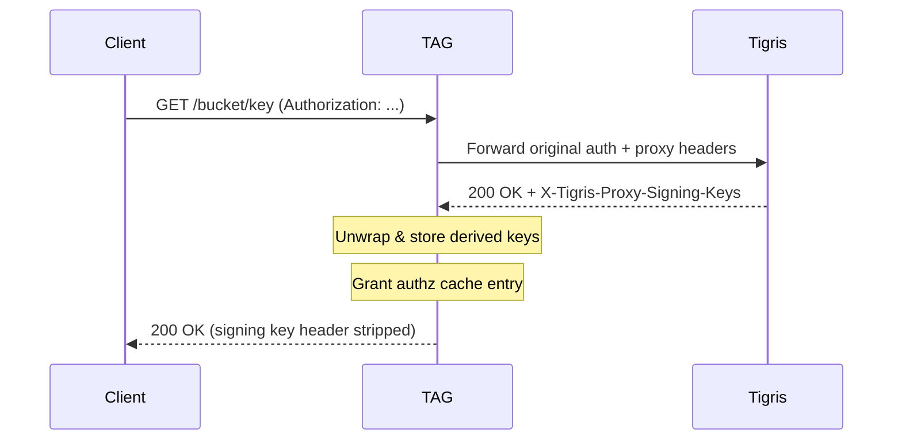
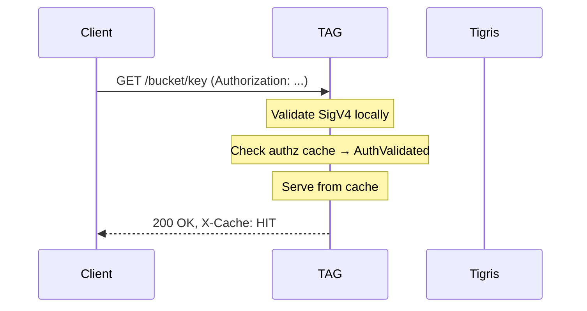
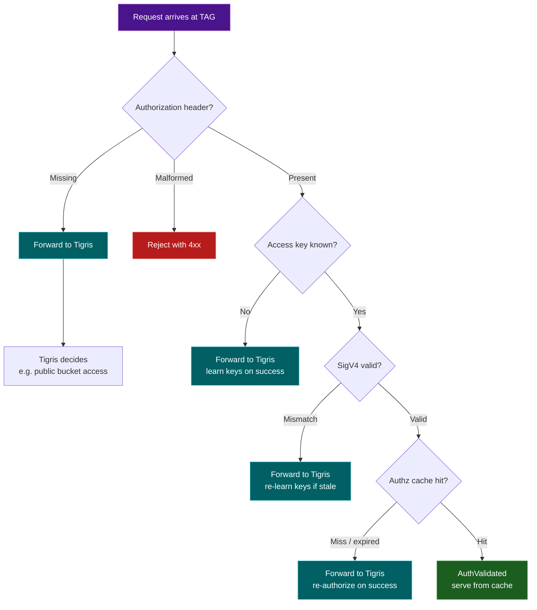

# Security and access control

TAG is designed so your secret keys never leave your hands. This page explains
how authentication, authorization, and credential handling work under the hood.

## Authentication modes

TAG supports two authentication modes, controlled by the
`upstream.transparent_proxy` configuration option (default: `true`).

### Transparent proxy mode (default)

TAG forwards the client's original `Authorization` header to Tigris unchanged
and adds cryptographically signed proxy headers (`X-Tigris-Forwarded-Host`,
`X-Tigris-Proxy-Access-Key`, `X-Tigris-Proxy-Timestamp`,
`X-Tigris-Proxy-Signature`) computed with TAG's own secret key. Tigris
independently validates both the client's SigV4 signature and TAG's proxy
signature in a single round-trip.

This is the recommended mode: TAG never sees client secret keys, client
credentials do not need to be stored anywhere other than on the client, and
Tigris retains full control over authorization decisions.

### Signing mode

When `transparent_proxy: false`, TAG operates in signing mode. In this mode, TAG
validates incoming requests against its local credential store and then re-signs
them with TAG's own credentials for the Tigris upstream.

Signing mode is useful when TAG needs to perform credential translation — for
example, when clients use internal credentials that Tigris does not recognize.
Note that in signing mode, clients must have their signing keys provisioned in
TAG's credential store.

To enable signing mode:

```bash
TAG_TRANSPARENT_PROXY=false ./tag
```

Or via config file:

```yaml
upstream:
  transparent_proxy: false
```

:::note

Transparent proxy mode is the default and is strongly recommended. Use signing
mode only when you have a specific need for credential translation.

:::

## Local authentication

TAG doesn't call Tigris on every request. After your client's first request, TAG
learns enough to validate signatures locally — so cache hits skip the network
entirely.

### How it works

On the first request, TAG learns your client's derived signing keys from Tigris.
Every request after that is validated locally:

**First request (key learning):**

<div className="mermaid-frame">



</div>

**Subsequent requests (local validation):**

<div className="mermaid-frame">



</div>

## Access control flow

Here's the full decision tree TAG uses when a request arrives. Most paths end
with a forward to Tigris — TAG only serves from cache when it has both a valid
signature and a cached authorization grant:

<div className="mermaid-frame">



</div>

## Authorization lifecycle

Authorization decisions are cached per `(accessKey, bucket)` pair:

| Event                                | Action                                    |
| ------------------------------------ | ----------------------------------------- |
| Tigris returns 2xx with signing keys | `AuthzCache.Grant(accessKey, bucket)`     |
| Tigris returns 403                   | `AuthzCache.Revoke(accessKey, bucket)`    |
| TTL expires (10 min default)         | Entry removed, next request re-authorizes |

Authorization is strictly per-bucket. A client may have access to some buckets
but not others, and TAG enforces this at the cache level.

## Proxy header security

### Preventing client injection

TAG overwrites any client-supplied proxy header values with TAG's own computed
values. Clients cannot impersonate TAG or bypass proxy authentication.

### Proxy signature computation

TAG computes the proxy signature using its own secret key. Only TAG (and Tigris,
which knows TAG's key) can produce a valid proxy signature.

## Endpoint validation

TAG validates the upstream endpoint at startup to prevent misconfiguration and
SSRF attacks.

**Allowed hosts:**

| Pattern         | Example                          | Use case                  |
| --------------- | -------------------------------- | ------------------------- |
| `localhost`     | `http://localhost:8080`          | Development and testing   |
| `*.tigris.dev`  | `https://fly.storage.tigris.dev` | Tigris production domains |
| `*.storage.dev` | `https://t3.storage.dev`         | Tigris storage domains    |

Any other endpoint causes a fatal startup error.

## Credential requirements

TAG requires its own Tigris credentials via environment variables:

```bash
export AWS_ACCESS_KEY_ID=<TAG's access key>
export AWS_SECRET_ACCESS_KEY=<TAG's secret key>
```

These credentials must have **read-only access** to all buckets accessed through
TAG. This is required for:

- Signing proxy headers
- Background cache fetches (e.g., fetching full objects after a range request
  cache miss)

TAG's access key must belong to the same Tigris organization as client access
keys. Clients use their own credentials directly — TAG does not need or store
client secret keys.

## Error mapping

| Auth error         | S3 error code         | HTTP status | Action            |
| ------------------ | --------------------- | ----------- | ----------------- |
| Signature mismatch | SignatureDoesNotMatch | 403         | Forward to Tigris |
| Unknown access key | InvalidAccessKeyId    | 403         | Forward to Tigris |
| Expired request    | RequestTimeTooSkewed  | 403         | Forward to Tigris |
| Malformed auth     | MalformedAuth         | 400         | Reject at TAG     |
| Missing auth       | (none)                | (none)      | Forward to Tigris |
