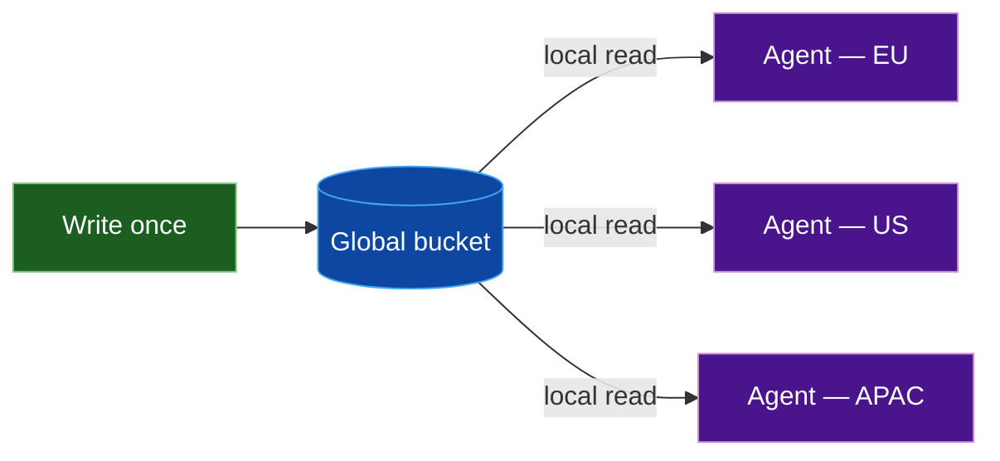
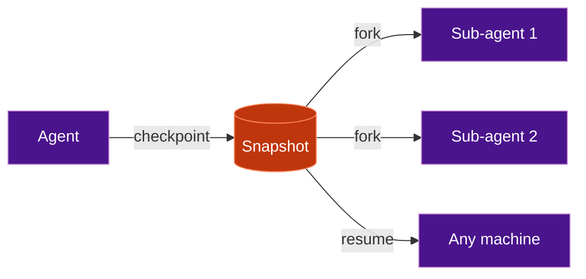
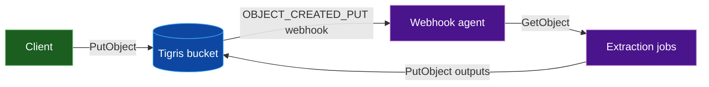
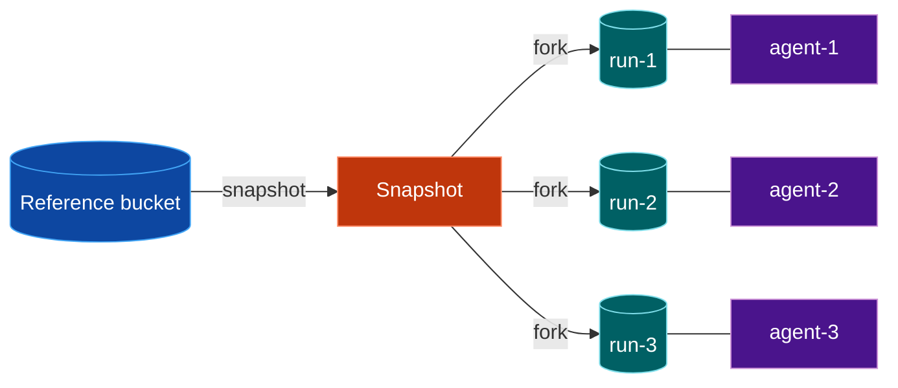
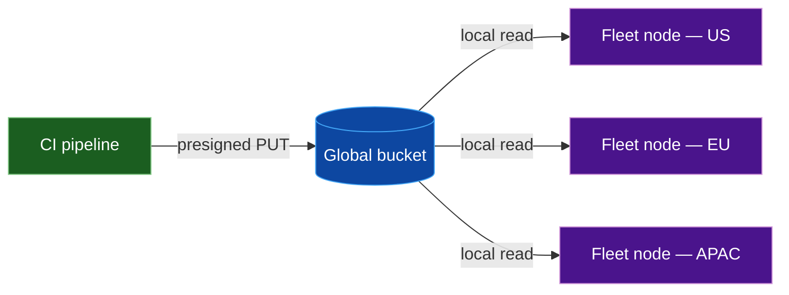
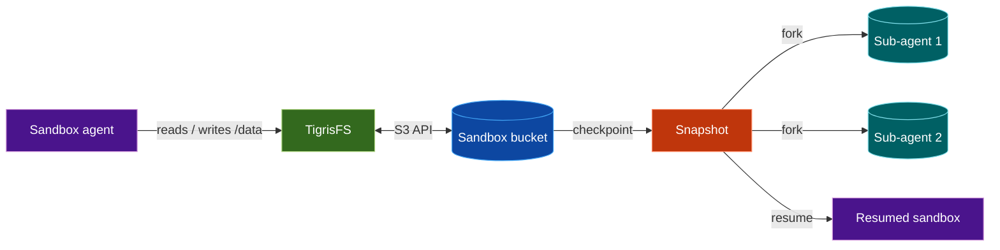

import {
  HomepageCard as Card,
  HomepageSection as Section,
} from "@site/src/components/HomepageComponents.jsx";

# Tigris Storage for AI Agents

AI agents are stateful, distributed, and write-heavy in ways that web services
aren't. They read their own outputs repeatedly across regions, checkpoint
execution state constantly, and generate artifacts such as vector embeddings and
sandbox snapshots that downstream processes depend on.

This page covers six patterns where Tigris's architecture fits the access
patterns of agent systems better than conventional S3.

## Six Core Use Cases

<Section>
  <Card
    title="Persist agent memory globally"
    description="Store memory artifacts in a global bucket with zero egress reads from any region."
    to="#persist-agent-memory-globally"
    icon="img/atom"
  />
  <Card
    title="Checkpoint and resume agents anywhere"
    description="Snapshot agent state and resume on any machine from a fast, local copy."
    to="#checkpoint-and-resume-agents-anywhere"
    icon="img/spark"
  />
  <Card
    title="Trigger processing pipelines on upload"
    description="Replace polling loops with push-based object notifications."
    to="#trigger-processing-pipelines-on-upload"
    icon="img/globe"
  />
  <Card
    title="Fork storage for isolated eval runs"
    description="Give each eval run its own copy-on-write view of a dataset without copying it."
    to="#fork-storage-for-isolated-eval-runs"
    icon="img/lightning"
  />
  <Card
    title="Distribute agent artifacts to a global fleet"
    description="Write once, read from the nearest region without setting up replication jobs."
    to="#distribute-agent-artifacts-to-a-global-fleet"
    icon="img/bolt"
  />
  <Card
    title="Provision isolated storage for ephemeral sandboxes"
    description="Back each sandbox with its own bucket mounted via TigrisFS."
    to="/agents-sandboxing/"
    icon="img/cube"
  />
</Section>

## 1. Persist agent memory globally

Agents generate memory artifacts continuously at runtime: embeddings, graph
nodes, extracted text, and metadata indexes that are written on every step and
re-read on every query. Unlike static deployment assets, this data changes
frequently and the read rate is high: a single retrieval pass might issue dozens
of `GetObject` calls across the same keys.

A [global bucket](/docs/buckets/multi-region/) serves every read from the nearest replica at no egress cost, so
those read-heavy loops don't accumulate transfer fees regardless of which region
the agent is running in. 

<div className="mermaid-frame">

</div>
<div className="mermaid-caption">
  Figure 1: One global bucket serves local reads for agents in every region.
</div>

In practice, you point all agents at a single global bucket and choose a stable
keying scheme for memory artifacts (for example `runs/{run_id}/memory/{step}`).
Writers only ever call `PutObject` into that bucket. Readers in any region use
plain `GetObject` calls against the same keys and automatically hit the nearest
replica.

For more information, see the docs:
[Multi-region buckets](/docs/buckets/multi-region/) ·
[Metadata querying](/docs/objects/query-metadata.md) ·
[Object regions](/docs/objects/object_regions/) (per-object residency)

:::note

Global buckets are [strongly consistent within a region](/docs/concepts/consistency/) and eventually consistent
across regions. 

:::

## 2. Checkpoint and resume agents anywhere

When you need agents to pick up exactly where they left off, you have to
checkpoint their state somewhere durable.

In practice, that means saving snapshots of their state at safe points so you
can restart them after failures or migration. [Storing snapshots in Tigris](/docs/buckets/snapshots-and-forks/) makes
them available from the nearest region to whichever machine picks up the resumed
agent, with no cross-region prefetch and no egress cost on the read. Agents that
need filesystem semantics can mount the bucket directly via [TigrisFS](/docs/training/tigrisfs/) and see a
plain `/data` directory. 

<div className="mermaid-frame">

</div>
<div className="mermaid-caption">
  Figure 2: Agents checkpoint into a snapshot, then either resume from it or
  fork new sub-agents.
</div>

The diagram shows two distinct things a snapshot enables, and they don't have to
happen together. **Resume** is straightforward: the agent fails or migrates,
your orchestrator restarts it on a new machine and points it at the snapshot
version, and it picks up from that exact state. **Fork** is different: you
deliberately branch from a snapshot to run sub-agents in parallel against the
same starting state, each writing into their own isolated view.

To wire either up, create the bucket with snapshots enabled and have the agent
write checkpoints on a fixed cadence or at logical boundaries. Store the version
ID alongside the agent's run ID and pass it into your orchestration layer when
you need to resume or fan out.

For more information, see the docs:
[Bucket snapshots and forks](/docs/buckets/snapshots-and-forks/) ·
[TigrisFS](/docs/training/tigrisfs/)

:::note

`X-Tigris-Enable-Snapshot: true` must be set at bucket creation and cannot be
changed afterward.

:::

## 3. Trigger processing pipelines on upload

If you want your agent to react to new uploads immediately, you need events
instead of a slow polling loop. Tigris lets your storage layer call a webhook so
your worker code can start processing as soon as a file lands.

Polling buckets on a schedule creates indexing lag, wastes API quota on
unchanged keys, and produces thundering-herd load during upload spikes. [Tigris
Object Notifications](/docs/buckets/object-notifications/) replace the polling loop with a push model. An HTTP `POST`
request fires to your webhook the moment an object lands, carrying the bucket,
key, size, and ETag needed to begin processing immediately. 

<div className="mermaid-frame">

</div>
<div className="mermaid-caption">
  Figure 3: Each upload immediately triggers a webhook that starts the
  processing pipeline.
</div>

You configure a notification rule through the Tigris Dashboard, pointing it at
an HTTPS endpoint your agent controls. On each `OBJECT_CREATED_PUT`, the agent
receives the bucket, key, and ETag, calls `GetObject` to stream the payload, and
writes derived artifacts back under a separate prefix such as `derived/` or
`indexes/`.

For more information, see the docs:
[Object notifications](/docs/buckets/object-notifications/) ·
[Notification filtering](/docs/buckets/object-notifications/#filtering)

:::tip

Filter webhooks to exactly the events you need:

```sql
WHERE `key` REGEXP "^raw/videos" AND `Event-Type` = "OBJECT_CREATED_PUT"
```

:::

:::note

Notifications are delivered at least once and can arrive out of order across
regions. Use the `Last-Modified` timestamp on the object (not `eventTime`) to
sequence events correctly, and design your handler to be idempotent.

:::

## 4. Fork storage for isolated eval runs

When you run lots of evals over the same dataset, you typically want each run
isolated without copying all the data. With Tigris, each run gets its own
lightweight forked view so you can write freely without worrying about breaking
the shared source.

Copying a full dataset bucket before each eval run is slow and expensive at
scale. [Tigris forks](/docs/buckets/snapshots-and-forks/) create a copy-on-write snapshot of a bucket instantly. Each
run gets full isolation, mutations in one fork never affect another, and the
source dataset stays unchanged for replay. 

<div className="mermaid-frame">

</div>
<div className="mermaid-caption">
  Figure 4: A reference bucket forks into isolated views so each eval run can
  write without affecting the source.
</div>

Your eval runner creates a snapshot from the reference bucket, then forks it
once per run and passes the forked bucket name into the job's environment. Runs
write metrics, temporary files, and artifacts into their own fork. When the eval
finishes, the runner either discards the fork or keeps it for audit and replay.

For more information, see the docs:
[Bucket snapshots and forks](/docs/buckets/snapshots-and-forks/) ·
[Using a forked bucket](/docs/buckets/snapshots-and-forks/#using-a-forked-bucket)

## 5. Distribute agent artifacts to a global fleet

Deployment artifacts such as model weights, compiled binaries, and config
bundles are the opposite of runtime memory: they change rarely, are written once
per release by a CI pipeline, and each fleet node reads them exactly once on
startup or rollout. The challenge is getting the same file to machines in many
regions without managing per-region storage or paying egress for every download.

A single `PutObject` to a global Tigris bucket makes the artifact available
worldwide. Fleet nodes read from the nearest replica at no egress cost, and
because the artifact is versioned and immutable, conditional `GetObject` calls
with `If-None-Match` let nodes skip the download entirely if they already have
the current version. No replication pipelines, no reconciliation logic.

<div className="mermaid-frame">

</div>
<div className="mermaid-caption">
  Figure 5: CI uploads an artifact once and fleet nodes fetch it from the
  nearest replica.
</div>

In CI, a release job requests a [presigned `PUT` URL for a versioned key](/docs/objects/presigned/) such as
`artifacts/{service}/{version}.tar.zst` and uploads the build output directly.
This keeps credentials off the runner and avoids routing traffic through your
own servers. Fleet nodes learn the key from your control plane and pull from the
bucket on startup or rollout. 

**Documentation:** [Presigned URLs](/docs/objects/presigned/) ·
[Custom domains](/docs/buckets/custom-domain/) ·
[Object regions](/docs/objects/object_regions/) (per-artifact residency)

## 6. Provision isolated storage for ephemeral sandboxes

If you run agents inside sandboxes, you often want their storage to feel like a
simple directory while still being durable and global.

Each sandbox gets its own Tigris bucket mounted via [TigrisFS](/docs/training/tigrisfs/). Your agents read
and write files under the mount point while your platform maps that to buckets
and snapshots behind the scenes. The agent sees a plain `/data` directory while
the platform stores everything as globally distributed objects. Snapshots and
forks handle mid-run checkpoints and sub-agent fan-out.

<div className="mermaid-frame">

</div>
<div className="mermaid-caption">
  Figure 6: Each sandbox writes to `/data` while TigrisFS backs it with its own
  bucket and snapshots.
</div>

The sandbox agent talks only to a TigrisFS mount that your platform wires to a
dedicated bucket per sandbox. Platform code is responsible for creating that
bucket, mounting it into the sandbox, and optionally snapshotting or forking it
when you need checkpoints, replay, or sub-agent fan-out.

## Next steps

| Topic                                                       | What you'll find there                                                                     |
| ----------------------------------------------------------- | ------------------------------------------------------------------------------------------ |
| [Get started with Tigris](/docs/get-started/)               | A guided walkthrough for creating buckets, uploading objects, and running basic workloads. |
| [Multi-region buckets](/docs/buckets/multi-region/)         | Details on available regions, replication behavior, and how to choose locations.           |
| [Snapshots and forks](/docs/buckets/snapshots-and-forks/)   | Concepts and API flows for creating snapshots, forking buckets, and managing versions.     |
| [Object notifications](/docs/buckets/object-notifications/) | How to configure webhooks, filter events, and build event-driven pipelines.                |
| [TigrisFS](/docs/training/tigrisfs/)                        | Instructions for mounting buckets as filesystems and working with `/data` inside agents.   |
| [Presigned URLs](/docs/objects/presigned/)                  | Patterns for generating scoped URLs for upload/download in CI and production apps.         |
