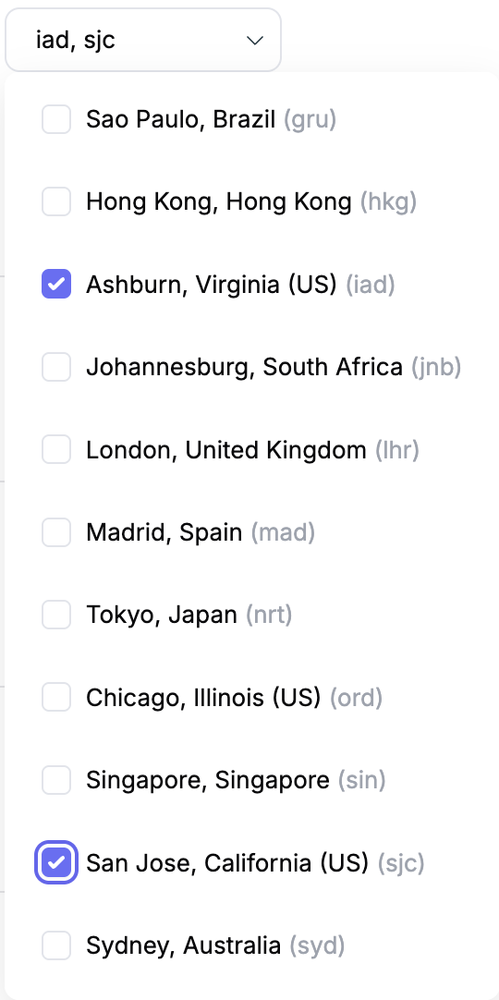

# Multi-Region Buckets

By default, Tigris automatically and intelligently distributes your data close
to the users. However, there might be cases where you wish to store data in
multiple regions to comply with legal regulations or to ensure data availability
in specific regions.

To achieve this for your bucket, you can specify multiple regions on the bucket
settings page under the "Regions" section.

:::note

Please consult the [Pricing](/docs/pricing/index.mdx#multi-region-buckets) page
for more details on how the storage cost is calculated when multiple copies are
stored.

:::

If you only want a subset of your data to be stored in specific regions you do
not need to specify the regions on the bucket settings page. Instead, you can
use the `X-Tigris-Regions` header in your PUT requests. Check out the
[Object Regions](/docs/objects/object_regions.md) section.
