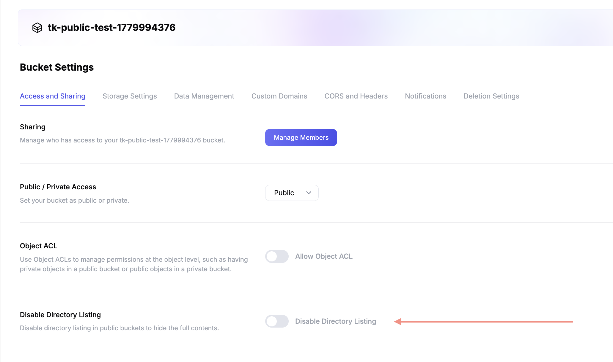

# Public Bucket

:::info

There is no additional charge to make buckets public. However, to prevent abuse,
payment method verification is required to use public bucket functionality. This
requirement applies to all organizations created after May 18, 2026.

:::

:::info

`https://t3.storage.dev` is the API endpoint for authenticated SDK and CLI
requests. Public bucket objects are not served from this domain — use the
[public bucket domains](#public-bucket-domains) below or a
[custom domain](./custom-domain.md).

:::

Sometimes you want to share your bucket with the world. You can do this by
creating a public bucket. This will allow anyone to read the contents of your
bucket. You can still control who can write to your bucket.

## Creating a public bucket using AWS CLI

Assuming you have the AWS CLI configured as shown in the
[AWS CLI guide](../sdks/s3/aws-cli.md), you can create a public bucket as
follows:

```bash
aws s3api --endpoint-url https://t3.storage.dev create-bucket --bucket foo-public-bucket --acl public-read
```

```text
$ aws s3api --endpoint-url https://t3.storage.dev create-bucket --bucket foo-public-bucket --acl public-read
{
    "Location": "/foo-public-bucket"
}
```

The key here is the `--acl public-read` flag. This will allow anyone to read the
contents of the bucket `foo-public-bucket`.

## Accessing objects in a public bucket

Objects in a public bucket (by default) can be read without any authentication.
However, only those with access to the bucket can write objects.

Let’s upload a file to our public bucket:

```bash
$ aws s3api --endpoint-url https://t3.storage.dev put-object --bucket foo-public-bucket --key bar.txt --body bar.txt
{
    "ETag": "\"c157a79031e1c40f85931829bc5fc552\""
}
```

Now, anyone can read this file without authentication.

### Public bucket domains

Every public bucket is automatically served over several dedicated public
content domains. Using `foo-public-bucket` as an example, the bucket is
accessible at:

| Domain                           | Example URL                                            |
| -------------------------------- | ------------------------------------------------------ |
| `BUCKET_NAME.t3.tigrisfiles.io`  | `https://foo-public-bucket.t3.tigrisfiles.io/bar.txt`  |
| `BUCKET_NAME.t3.tigrisbucket.io` | `https://foo-public-bucket.t3.tigrisbucket.io/bar.txt` |
| `BUCKET_NAME.t3.tigrisblob.io`   | `https://foo-public-bucket.t3.tigrisblob.io/bar.txt`   |

All three domains serve the same content without authentication and are
interchangeable.

:::warning

The public bucket domains don’t work with dots in bucket names because the SSL
wildcard certificate only matches bucket names that do not contain dots. Dots
create multiple subdomain levels that a single wildcard certificate doesn’t
cover. Use a [custom domain](#custom-domain) if your bucket name contains dots.

:::

### Virtual-hosted–style request

Virtual host style URLs are the default way of referencing your objects. In a
virtual-hosted–style URI, the bucket name is part of the domain name in the URL.

Virtual-hosted–style URLs use the following format:

```text
https://bucket-name.t3.tigrisbucket.io/key-name
```

So for the object we just uploaded, the virtual-hosted–style URL would be:

```bash
$ wget https://foo-public-bucket.t3.tigrisbucket.io/bar.txt -O- -q
bar
```

:::warning

Virtual-hosted–style access doesn’t work with dots in bucket names because the
SSL wildcard certificate only matches bucket names that do not contain dots.
Dots create multiple subdomain levels that a single wildcard certificate doesn’t
cover. Use a [custom domain](#custom-domain) if your bucket name contains dots.

:::

### Path-style request

For buckets created on or after February 19, 2025, path-style URLs are no longer
supported. For buckets created before February 19, 2025, path-style URLs will
continue to function. However, we recommend updating your code to use
virtual-hosted style URLs as it provides a unique subdomain per bucket.

Path-style URLs use the following format:

```text
https://t3.tigrisbucket.io/bucket-name/key-name
```

So for the object we just uploaded, the path-style URL would be:

```bash
$ wget https://t3.tigrisbucket.io/foo-public-bucket/bar.txt -O- -q
bar
```

:::info

You can have a mix of public and private objects in a public bucket. By default,
all objects inherit the access control settings of the bucket they are in. If a
bucket is `public-read`, all objects are publicly readable. If you want to make
an object private, you can set the object ACL to `private`. See the
[Object ACLs](../objects/acl.md) guide for more information.

:::

## Directory listing

Public buckets allow anonymous reads of individual objects, but **anonymous
directory listing is disabled by default**. A request for a specific key
succeeds, while a `ListObjects` request on the bucket root returns
`403 AccessDenied`:

```bash
# Works — anonymous object read
$ curl https://foo-public-bucket.t3.tigrisbucket.io/bar.txt
bar

# Returns 403 — anonymous bucket listing is disabled by default
$ curl https://foo-public-bucket.t3.tigrisbucket.io/
<?xml version="1.0" encoding="UTF-8"?>
<Error><Code>AccessDenied</Code><Message>Access Denied.</Message>...</Error>
```

This default applies to public buckets created through any path (Tigris console,
Tigris CLI, Fly CLI, or the S3 API).

To enable anonymous directory listing on a bucket:

- **Tigris CLI:**

  ```bash
  tigris buckets set foo-public-bucket --disable-directory-listing=false
  ```

- **Tigris Console:** Bucket Settings → **Access and Sharing** → toggle **off**
  the "Disable Directory Listing" switch. The toggle is intentionally inverted —
  turning it **off** is what **enables** public listing.

  

## Custom domain

For production use, we recommend configuring a
[custom domain](./custom-domain.md) for your public bucket. A custom domain
gives you:

- **Brand consistency** — serve content from your own domain (e.g.,
  `assets.example.com`) instead of a Tigris-managed domain.
- **Portability** — your URLs stay stable if you ever change your underlying
  storage configuration.
- **No dot-in-name restrictions** — custom domains work regardless of whether
  your bucket name contains dots.

To set up a custom domain, create a CNAME record pointing your domain to
`foo-public-bucket.t3.tigrisbucket.io` and then configure the domain in your
bucket settings. See the [Custom Domains](./custom-domain.md) guide for full
instructions.

## Hosting a static website

A public bucket can serve a static website directly, with no separate web server
or CDN. Files are served over the
[public bucket domains](#public-bucket-domains) or a
[custom domain](#custom-domain), cached at the edge, with no egress charge.

1. Make the bucket public, as shown above.
2. Upload your files, setting `Content-Type` on each object so browsers render
   them correctly. For example, use `text/html` for `.html` files.
3. Link to each file by its full key, such as
   `https://foo-public-bucket.t3.tigrisfiles.io/index.html`.

:::warning[No default index document]

Tigris serves objects by their exact key. A request to the bucket root (`/`)
returns a directory listing (when [directory listing](#directory-listing) is
enabled) or `403 AccessDenied`. It never serves `index.html`, and the same
applies to subpaths: `/app/` returns `404 NoSuchKey` even when `app/index.html`
exists. Link to each page by its full key, such as `/index.html` or
`/app/index.html`.

This shapes how single-page apps work. Load the app from an explicit key like
`/index.html`, not the bare domain, which does not serve it. From there,
hash-based routing (`/index.html#/dashboard`) works, because every route is
served by the same `index.html` object. Path-based routing (`/dashboard`) does
not: a direct request or refresh returns `404 NoSuchKey` before the app loads,
which cannot be fixed in app code. It needs a CDN or edge layer in front of the
bucket to rewrite unknown paths to `index.html`.

:::
