# Bucket Settings

The Tigris Dashboard lets you configure various settings for your buckets.
Here's an overview of the settings you can configure:

- Bucket Sharing: Share buckets between your organization members or outside
  collaborators.
- Public / Private Access: Set the default access rules for a bucket.
- Storage Tier: Set the storage tier for a bucket.
- Custom Domains: Configure a custom domain to serve your bucket content.
- Object Notifications: Subscribe to events on your buckets.
- Data Migration: Migrate data from one bucket to another.
- Region Restriction: Restrict the regions where your bucket data is stored.
- Cache Control: Set the default `Cache-Control` header for objects in the
  bucket.
- Additional Headers: Configure implicit response headers for objects stored in
  your buckets.
- TTL Configuration: Set the default time-to-live (TTL) for objects in the
  bucket.
- Object Lifecycle: Set an Object Lifecycle rule for objects in the bucket.
- CORS Configuration: Configure Cross-Origin Resource Sharing (CORS) rules for
  your bucket.
- Deletion Protection: Prevent accidental deletion of your bucket by enabling
  this setting.
- Delete This Bucket: Permanently delete a bucket.

## Sharing

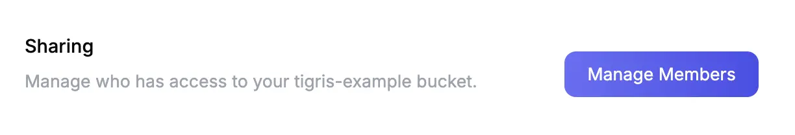

You use Bucket Sharing to share buckets between your organization members or
outside collaborators. For more information, please see the bucket sharing page:
[Bucket Sharing](/docs/buckets/sharing/).

## Public / Private Access

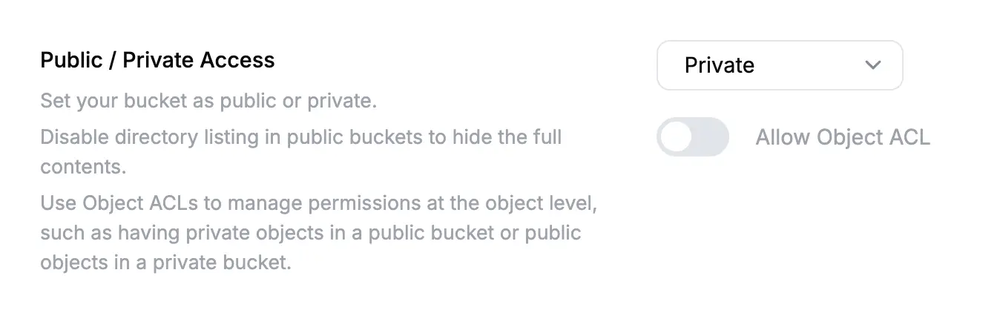

Tigris lets you control the [access rules](/docs/buckets/public-bucket/) for a
bucket. This section lets you set the default access rules for a bucket (either
public or private). You can optionally enable "Allow Object ACL" to let you
customize public/private status
[for individual objects](/docs/objects/acl/#applying-acls-to-objects).

## Storage Tier

This is set on bucket creation and cannot be changed. For more information,
please see the storage tiers page: [Storage Tiers](/docs/objects/tiers/).

You can set the storage tier for individual objects when you upload them. For
more information, please see the storage tiers page:
[Storage Tiers: Setting object tier](/docs/objects/tiers/#setting-object-tier)

## Custom Domains

You can configure a custom domain to serve your bucket content. The custom
domain must have a CNAME record that points to the bucket URL. For example, if
you own the domain `images.example.com` and bucket `foo-bucket`, the CNAME
record for `images.example.com` should point to `foo-bucket.t3.storage.dev`.

For more information see the [Custom Domains](/docs/buckets/custom-domain/)
documentation.

## Object Notifications

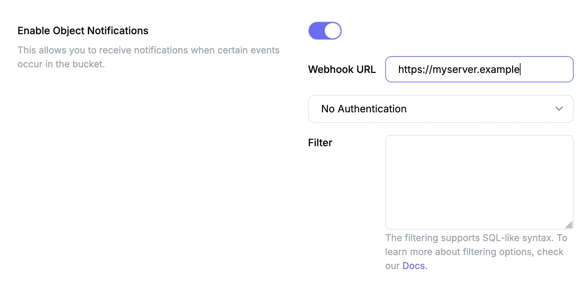

Object notifications allow you to subscribe to events on your buckets. For more
information see the [Object Notifications](/docs/buckets/object-notifications/)
documentation. You can configure the following settings:

- Webhook URL: The URL to send the notification to.
- Authentication type: None, token or password.
- Filter: SQL style filtering for objects.

Tigris will notify you on the following events:

- New objects being put into buckets.
- Existing objects being deleted from buckets.

## Data Migration

You can migrate data from one bucket to another using the
[data migration](/docs/migration/) feature. This will automatically copy data
that isn't in Tigris over to Tigris when it's needed. Tigris implements the
following migration strategy:

1. When an object is requested, it is served from your Tigris bucket if it is
   found.
2. If the object is not found in Tigris bucket, the object will be returned from
   your source bucket and asynchronously copied to Tigris.
3. All other operations, including put and delete, continue to work as usual

If you enable the write-through option, Tigris will write the object to your
source bucket and Tigris bucket at the same time. This is useful for keeping
your source bucket in sync with Tigris.

## Region Restriction

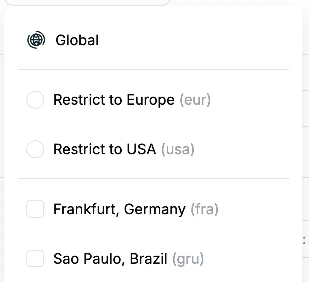

You can restrict the regions where your bucket data is stored, ensuring that all
requests are directed to a single region or a few selected regions. This setup
is especially useful for compliance with data protection regulations that
mandate data residency in specific regions. However, it's important to note that
restricting your bucket to a single region (or a few regions) may impact
performance, particularly in a globally distributed environment. It can lead to
higher latency for users located far from the selected regions, as all requests
must be routed to the restricted location..

For more information see the [region restriction](/docs/objects/object_regions/)
documentation.

## Cache Control

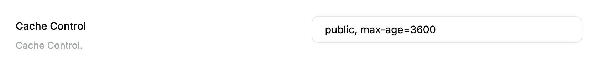

This lets you set the default `Cache-Control` header for objects in the bucket.
Tigris will set some
[cache control headers by default](/docs/objects/caching/#cache-headers) for
public objects, but you can set an implicit default here.

## Additional Headers

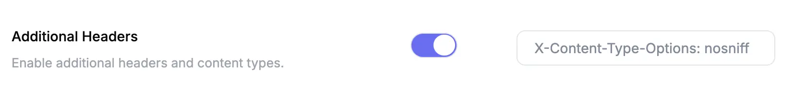

You can configure additional headers for objects stored in your buckets. This
can be useful when your tools set incorrect headers or you need to set custom
headers. Right now the only setting implemented is to set the
`X-Content-Type-Options` header to `nosniff`, which prevents browsers from
performing "content sniffing" and guessing the MIME type of the content based on
the content itself.

## TTL Configuration

You can set the default time-to-live (TTL) for objects in the bucket. This is
useful for buckets that contain ephmemeral data that should be deleted after a
certain period of time. For more information see the
[Object Expiration](/docs/buckets/objects-expiration/) documentation.

You can configure the following modes:

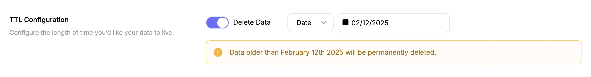

You can configure Tigris to delete anything older than a given date. This lets
you clean up a bucket by deleting old data on the server side.

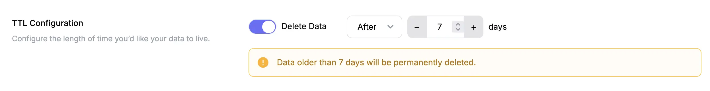

You can also configure Tigris to automatically delete any object older than a
given number of days.

## Object Lifecycle

You can set an Object Lifecycle rule for objects in the bucket. This is useful
for buckets that contain lots of old objects that are not accessed that often.
They can be transitioned to a different storage tier after a certain period of
time. For more information see the
[Object Lifecycle](/docs/buckets/object-lifecycle-rules/) documentation.

## CORS Configuration

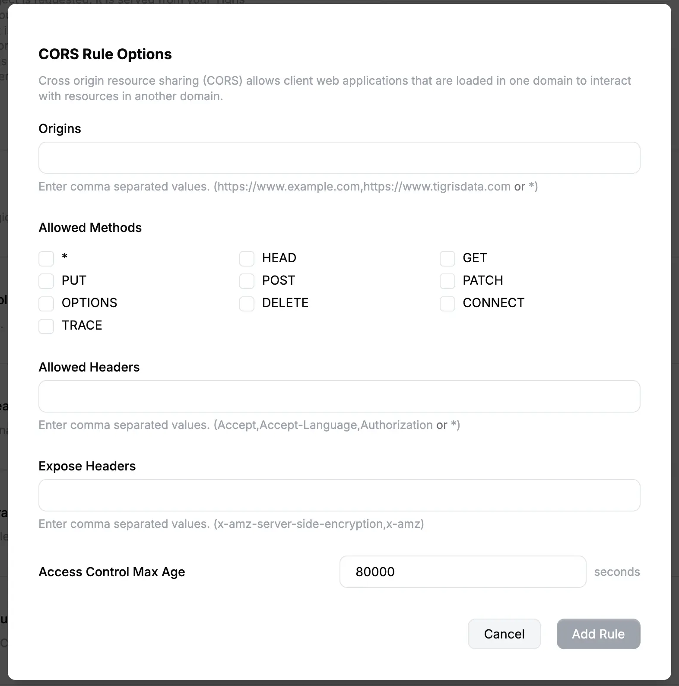

You can configure
[Cross-Origin Resource Sharing (CORS)](https://developer.mozilla.org/en-US/docs/Web/HTTP/CORS)
rules for your bucket. This allows you to have a website dynamically fetch data
from Tigris. For more information see the
[CORS Configuration](/docs/buckets/cors/) documentation.

## Delete Protection

When Delete Protection is enabled, no files in the bucket can be deleted. This
setting prevents accidental or unauthorized deletion of objects, ensuring that
all data in the bucket remains safe until you turn off Delete Protection.

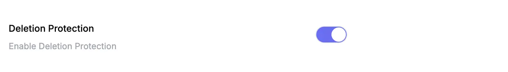

## Delete This Bucket

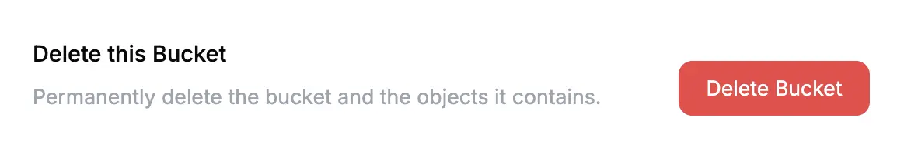

You can delete a bucket by clicking the "Delete Bucket" button. This will
permanently delete all objects in the bucket. This action cannot be undone.

When you delete a bucket, its name will become unavailable for reuse for a few
minutes while the deletion is processed. If you try to create a new bucket with
the same name during this time, you will receive an error.
