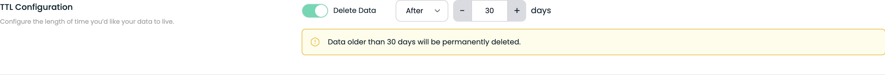
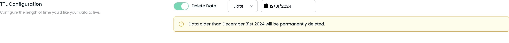

# Bucket Lifecycle Configuration

There are often scenarios where you need to automatically delete objects after a
specified period. Bucket lifecycle configurations enable you to achieve this.

## Create a bucket lifecycle configuration

To set up a bucket lifecycle configuration, you need to define rules that manage the
lifecycle of objects in the bucket. This can be done through the Tigris
dashboard or using standard AWS SDKs/CLIs.

## Setup

### Dashboard

- Go to the Tigris dashboard and select the bucket you want to configure.
- Go to bucket settings and select the lifecycle configuration.
- Switch on the "TTL Configuration" and set the desired TTL.

#### Enable deletion of objects after 30 days



#### Enable deletion of the objects at the 2024-year end



### AWS CLI

You can configure lifecycle of bucket using AWS CLI with following command:

```
aws s3api put-bucket-lifecycle-configuration --bucket my-bucket --lifecycle-configuration  file://lifecycle.json
```

Here are some example lifecycle configurations:

#### Enable deletion of objects after 30 days

```json
{
  "Rules": [
    {
      "ID": "Delete 30 days old objects",
      "Status": "Enabled",
      "Expiration": {
        "Days": 30
      }
    }
  ]
}
```

#### Enable deletion of the objects at the 2024-year end

```json
{
  "Rules": [
    {
      "ID": "Delete objects on end of year",
      "Status": "Enabled",
      "Expiration": {
        "Date": "2024-12-31T00:00:00Z"
      }
    }
  ]
}
```

:::note

Note that Tigris always rounds the TTL deletion time to UTC midnight for the
scheduled date.

:::
