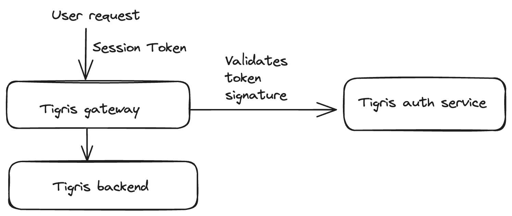
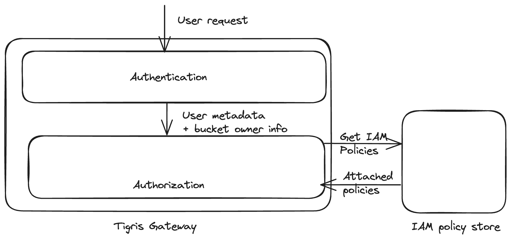

# Authentication & Authorization

Tigris being S3 compatible, offers S3-supported authentication and authorization
methods. AWS S3 evolved in offerings for their authentication and authorization
needs. We support what AWS S3 recommends to their users as of now for the AuthN
and AuthZ needs.


## Authentication

Tigris offers two mechanisms for authentication.

- AWS signature version 4
- Session token

### AWS Signature version 4

This authentication method is based on a hash-based signature. The first
selected element of the request is picked and converted to a string. A signing
key signs this formed string version and a hash-based message authentication
code (`HMAC`) is derived. The signing key is derived from the secret access key.
The AWS S3 SDK handles this signature generation part.

The server then receives a request along with the signature and the
access_key_id. The server recreates the signature and compares the incoming
signature. This is how the server authenticates and fetches the authenticated
user’s context.

This mechanism relies on the access key - Tigris supports IAM’s
`CreateAccessKey` API to generate access keys. These keys are stored on Tigris
server in an encrypted form with `AES` `256-bit` encryption.


### Session Token

This mechanism is based on the idea of temporary credentials. Within the Tigris,
this is mainly used for human users when interacting with Tigris’s web console.
The session token has a limited lifetime. Tigris uses `JWT` (JSON Web Token) as
the session token. This token is signed by an authentication provider using the
`RS256` algorithm. When the user logs in to Tigris’s web console, Tigris’s
authentication service issues the `JWT` which has a lifetime of 24 hours. This
JWT contains the metadata about the user, for example: the org ids, and user id.
Here is an example of a JWT payload.

```
{
  "https://tigris": {
    "e": "jmj@tigrisdata.com",
    "ns": ["tigris-data"]
  },
  "iss": "https://tigrisdata-dev.us.auth0.com/",
  "sub": "oauth2|flyio-sso|<123>",
  "aud": [
    "https://tigris-os-api-dev",
  ],
  "iat": 1699302053,
  "exp": 1699388453,
  "azp": "<azp_val>",
  "scope": "openid profile email offline_access"
}
```

As shown above, the token contains the Tigris’s tenant id (https://tigris.n) and
user’s email address (https://tigris.e) along with the user id (`sub`).

This session token is signed by Tigris’s authentication service using `RS256`.
This token is fed to the AWS S3 client as a session token field. When a Tigris
server receives a request containing the session token via header
`x-amz-security-token`, Tigris validates the signature of the JWT by using the
public key rendered by Tigris’s authentication service. If the signature is
valid, Tigris server further validates the claims made by the token. Such as
issuer, audience, and expiration.



## Authorization

Tigris supports AWS’s IAM policies mechanism as the authorization system. IAM
policies for s3 buckets are highly flexible and powerful to craft any sort of
access control.

Here is an example of the IAM policy

```
{
  "Version": "2012-10-17",
  "Statement": [
    {
      "Effect": "Allow",
      "Action": "s3:GetObject",
      "Resource": "arn:aws:s3:::images/*"
    }
  ]
}
```

    -   "Version": "2012-10-17": Specifies the version of the policy language.
    -   "Statement": An array of one or more statements that define the

permissions. In this case, there is only one statement.

    -   "Effect": "Allow": Specifies whether the action is allowed or denied.
    -   "Action": "s3:GetObject": Specifies the action that is allowed. In this

case, it allows the GetObject action, which is used for reading (downloading)
objects from the bucket.

    -   "Resource": "arn:aws:s3:::images/*": Specifies the Amazon Resource Name

(ARN) of the S3 resource to which the policy applies. In this example, it grants
permission to all objects (`/*`) in the specified bucket (`images`).

These policies are standalone on their own, they need to be attached to the user
in order to apply them.

After the user has been authenticated successfully, the system gets the context
about the current user. This context includes metadata about users like user_id,
user_role (namespace_owner, regular), for machine users (access keys),
human_user_id, and so on. Using these users’ metadata, Tigris pulls the attached
IAM policies for this user from its IAM store. Along with the user's context
with regards to the bucket is pulled if the user is the owner of the bucket.

With this information, Tigris evaluates the access and grants or denies access
to the operation.


