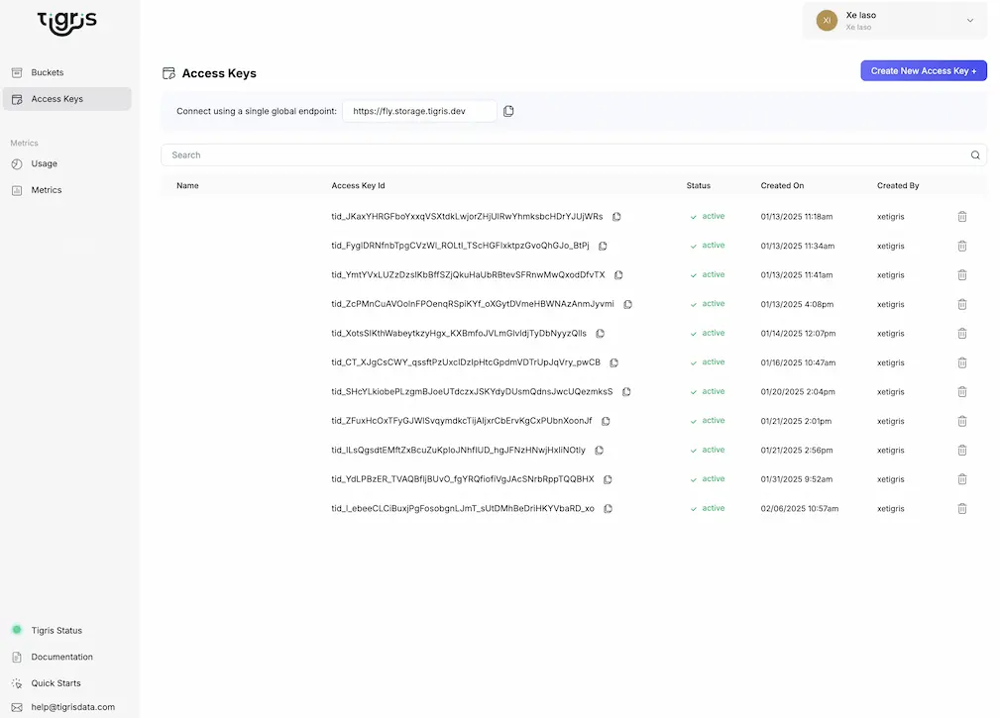
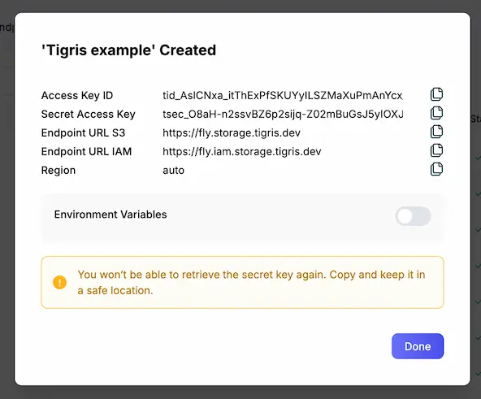

# Creating an Access Key

Tigris provides IAM (Identity and Access Management) support for managing access
to your buckets. This includes the ability to create and manage access keys
within your Tigris organization.

Clients need access keys to store files on Tigris. You can mint new access keys
from the [Tigris Dashboard](https://console.tigris.dev).

First, go to the [Tigris Dashboard](https://console.tigris.dev).

Click on Access Keys in the left-hand menu.

Click on the Create New Access Key button.

Give the key a name and assign the desired permissions. If you're unsure, you
can always come back and edit the permissions later. Some common permissions to
give:

- Admin access for your developer machine (not recommended for production)
- Read-only access to all buckets
- Editor access to a specific bucket or set of buckets (such as a bucket for a
  specific project or service)

Click Create.

Copy the credentials to your notes or password manager. You will not be able to
see them again. Then you can use them with
[the AWS S3 SDK and CLI](/docs/sdks/s3/) or any other S3 compatible system.
