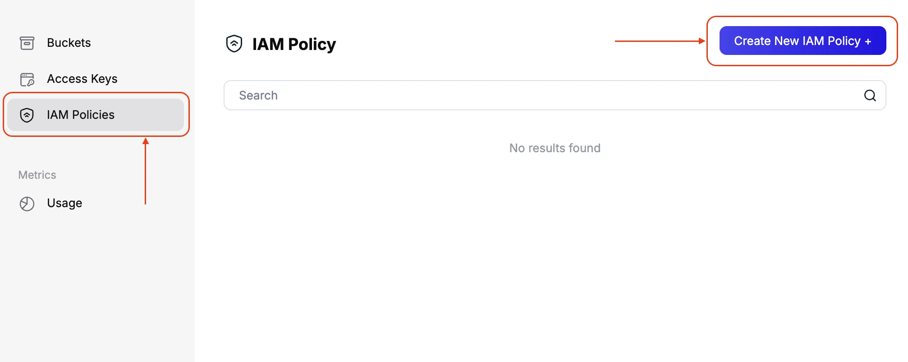
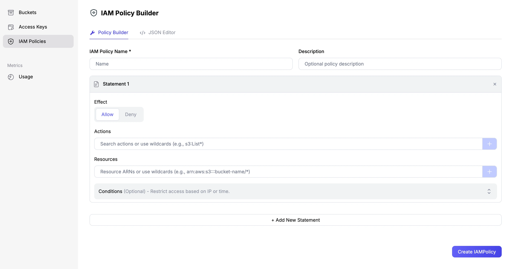
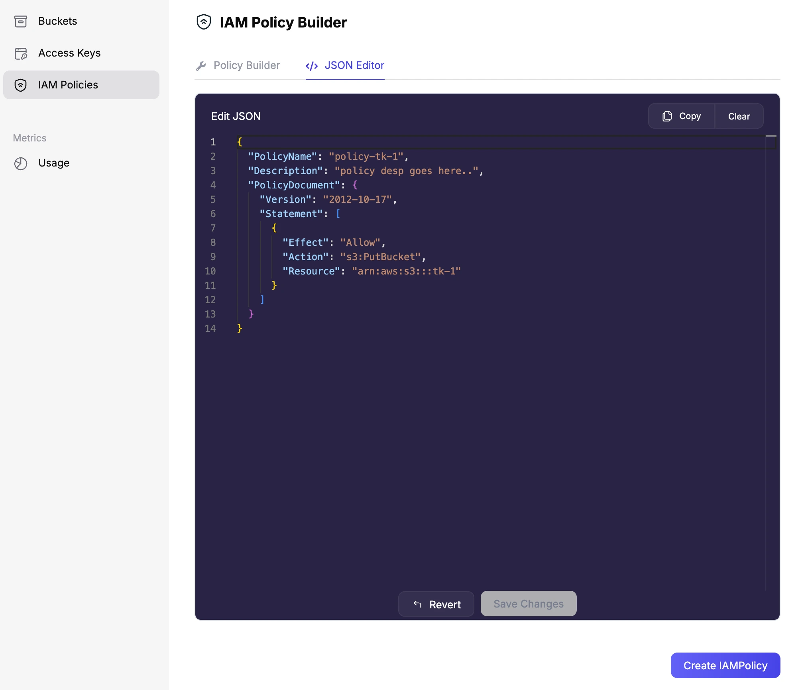
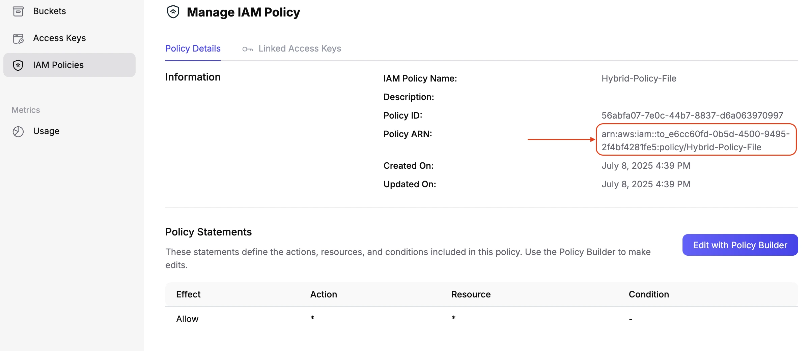
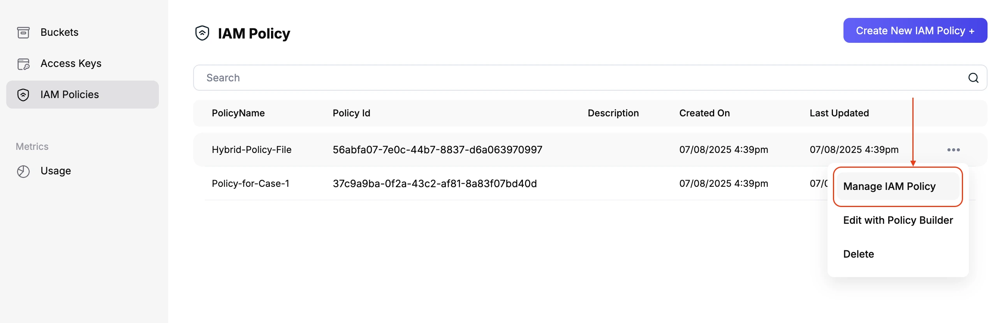
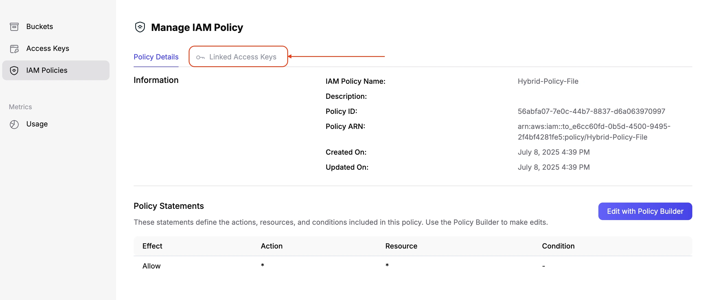
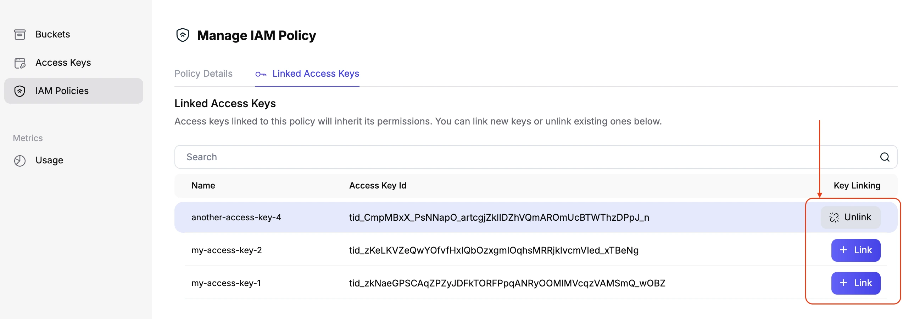

# Attaching IAM Policies

IAM policies are attached to access keys. If you delete and recreate an access
key, you'll need to attach IAM policies to the new access key.

:::note

Before you start, make sure you have your AWS CLI configured with the Tigris
credentials. You can do this by following the instructions in the
[Getting Started with Tigris](/docs/sdks/s3/aws-cli) guide.

:::

## 1. Create an access key in the Tigris Dashboard

First, create an access key. You can do this using the Tigris Dashboard or the
AWS CLI. For more information, refer to the
[Manage an Access Key](/docs/iam/manage-access-key/index.mdx) guide.

Make sure to **not** grant access to any bucket when creating the access key.
This will create an access key with no permissions.

## 2. Create the IAM policy

Then, create an IAM policy. Assuming you have already created a policy file
(`policy.json`), you can attach it to the access key using the following
command:

```bash
aws --profile=tigris iam --endpoint-url=https://iam.storage.dev create-policy --policy-name <example-org-level-unique-policy-name> --policy-document file:///path/to/policy.json
```

This command creates a new IAM policy using the specified JSON file. Make sure
to replace `<example-org-level-unique-policy-name>` with a unique name for your
policy.

Alternatively, you can create an IAM Policy directly from the
[Tigris Dashboard](https://console.tigris.dev). Navigate to "IAM Policies" in
the side menu and click the **Create New IAM Policy +** button to start the
policy creation process.



The Policy Builder makes it easy to create policies using either a simple form
or the flexible JSON Editor mode — choose whichever works best for you.





After creating your policy in the Tigris Dashboard, simply open the policy
details to find its `arn`—you’ll need this for Step 3.



## 3. Attach the IAM policy to the access key

Next, attach the IAM policy to the access key using the following command:

```bash
aws --profile=tigris iam --endpoint-url=https://iam.storage.dev attach-user-policy --policy-arn <generated_policy_arn_from_previous_step> --user-name <tid_>
```

This command attaches the IAM policy to the access key, allowing it to perform
the actions specified in the policy. Make sure to replace
`<generated_policy_arn_from_previous_step>` with the ARN of the policy you
created in the previous step and `<tid_>` with the access key ID you created in
the first step.

You can also attach policies easily through the
[Tigris Dashboard](https://console.tigris.dev):

- From the policy list, click on `Manage IAM Policy` next to the policy you want
  to update.



- On the policy detail page, click on `Linked Access Keys` to view and manage
  which access keys are connected to this policy.

  

- To connect or remove an access key, simply click the `+ Link` button to attach
  it, or the `Unlink` button to detach it as needed.

  
