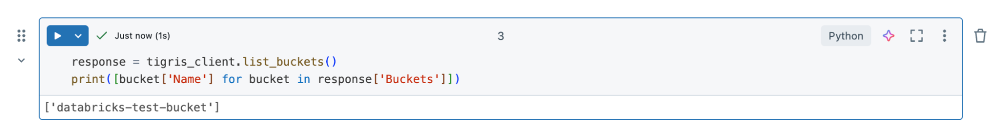
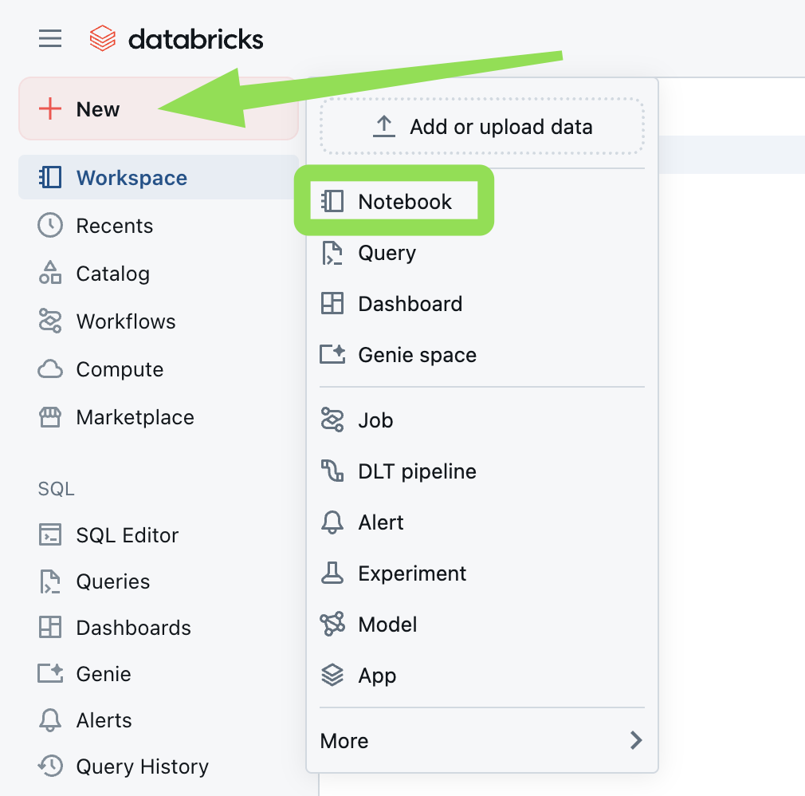
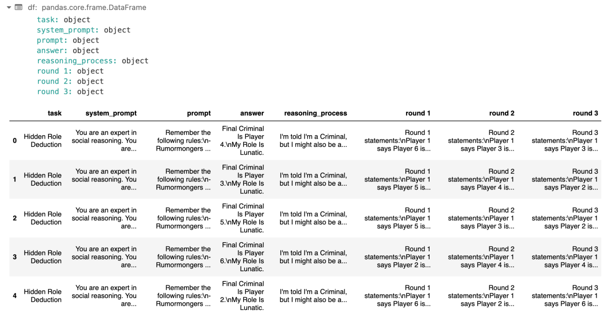
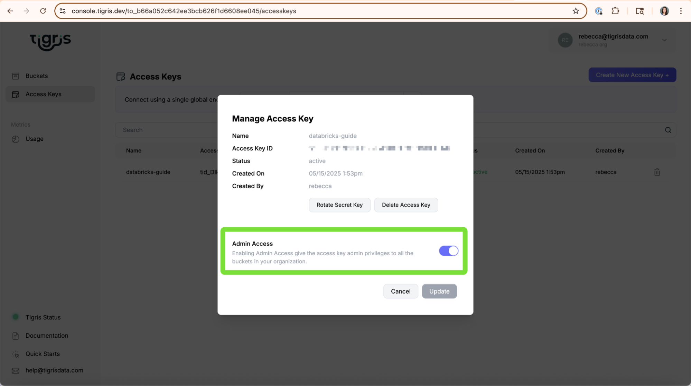

# Using Databricks with Tigris

This guide walks you through how to connect a Databricks notebook to a Tigris
bucket using serverless compute (the default in Databricks). By the end, you'll
be able to list and read Parquet files stored in Tigris from within your
Databricks environment.



## Prerequisites

Make sure you have the following information from your Tigris account:

- Tigris **Access Key ID**
- Tigris **Secret Access Key**
- Tigris **Endpoint** (e.g., `https://t3.storageapi.dev`)
- Tigris **Bucket Name**

If you don't yet have access credentials, follow the steps in the
[Access Key guide](https://www.tigrisdata.com/docs/iam/create-access-key/) to
create one.

---

## Step 1: Create or Log In to Databricks

Log in to your Databricks workspace or create a new one. Once inside, create a
**new notebook**.



---

## Step 2: Install Dependencies

In your Databricks notebook, install the required libraries:

```bash
pip install boto3 pandas pyarrow s3fs
```

After installing, restart the Python kernel:

```bash
%restart_python
```

---

## Step 3: Initialize the Tigris Client

Import the required libraries and set up the Tigris S3-compatible client using
`boto3`:

```python
import boto3

tigris_client = boto3.client(
    's3',
    aws_access_key_id='YOUR-ACCESS-KEY-ID',
    aws_secret_access_key='SECRET-ACCESS-KEY-ID',
    endpoint_url='https://t3.storageapi.dev',
    region_name='auto'  # Use 'auto' if Tigris shows your region as 'Global'
)
```

> 💡 Tip: If your Tigris dashboard lists the region as **Global**, use `'auto'`
> for `region_name` in Databricks.

---

## Step 4: Verify the Connection

Test your setup by listing your Tigris buckets:

```python
response = tigris_client.list_buckets()
print([bucket['Name'] for bucket in response['Buckets']])
```

You should see a list of your available Tigris buckets.

---

## Step 5: Read a Parquet File from Tigris

Use the following code to download and read a Parquet file from your Tigris
bucket:

```python
import pandas as pd
import pyarrow.parquet as pq
from io import BytesIO

# Define your bucket and file
bucket_name = 'databricks-test-bucket'
key = 'test/easy-00000-of-00002.parquet'

# Download to memory buffer
buffer = BytesIO()
tigris_client.download_fileobj(bucket_name, key, buffer)

# Rewind buffer
buffer.seek(0)

# Load and convert to DataFrame
table = pq.read_table(buffer)
df = table.to_pandas()

# Preview the data
df.head()
```



---

## Final Output

You should see a preview of your Parquet file loaded into a Pandas DataFrame:

```plaintext
   column1   column2   column3
0  value_1  value_2  value_3
1  value_4  value_5  value_6
...
```



---

## Conclusion

By following this guide, you've successfully:

- Connected a Databricks notebook to your Tigris bucket
- Installed required libraries for working with object storage
- Listed your available buckets
- Loaded a Parquet file into a Pandas DataFrame for analysis

You're now ready to use Tigris as a high-performance, low-cost backend for your
Databricks workflows.
