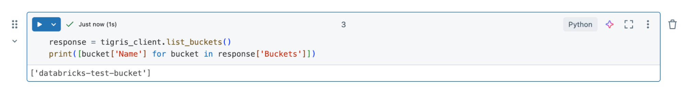
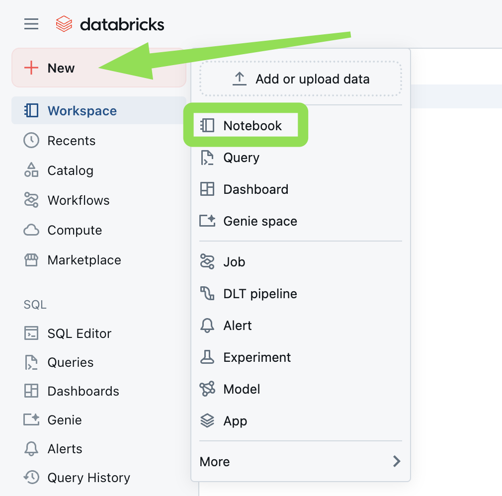
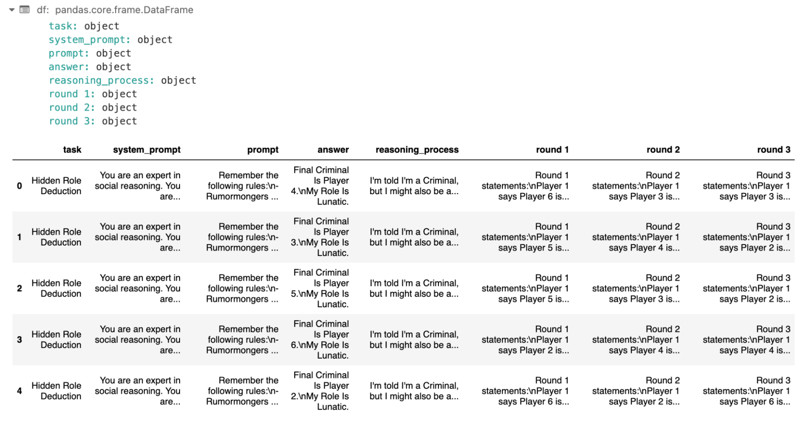
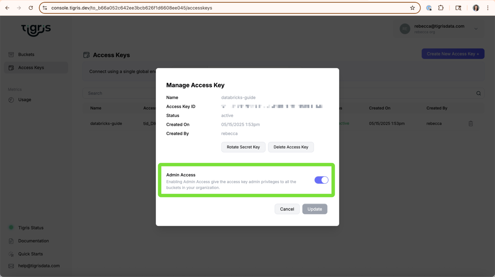

# Databricks

Connect a Databricks notebook to a Tigris bucket using serverless compute (the
default in Databricks). Tigris is S3-compatible, so you can use `boto3` to list
and read files stored in Tigris directly from your notebooks.



## Prerequisites

- Tigris **Access Key ID** and **Secret Access Key** (see the
  [Access Key guide](/docs/iam/manage-access-key/) if you need to create one)
- Tigris **Endpoint**: `https://t3.storage.dev`
- A Tigris **bucket** with data to read

## 1. Create a notebook

Log in to your Databricks workspace and create a new notebook.



## 2. Install dependencies

```bash
pip install boto3 pandas pyarrow s3fs
```

Then restart the Python kernel:

```bash
%restart_python
```

## 3. Initialize the Tigris client

```python
import boto3

tigris_client = boto3.client(
    's3',
    aws_access_key_id='YOUR-ACCESS-KEY-ID',
    aws_secret_access_key='YOUR-SECRET-ACCESS-KEY',
    endpoint_url='https://t3.storage.dev',
    region_name='auto'
)
```

Set `region_name` to `auto`. This works for all Tigris buckets.

## 4. Verify the connection

List your Tigris buckets to confirm the client is configured correctly:

```python
response = tigris_client.list_buckets()
print([bucket['Name'] for bucket in response['Buckets']])
```

## 5. Read a Parquet file

Download and read a Parquet file from your Tigris bucket:

```python
import pandas as pd
import pyarrow.parquet as pq
from io import BytesIO

bucket_name = 'databricks-test-bucket'
key = 'test/easy-00000-of-00002.parquet'

buffer = BytesIO()
tigris_client.download_fileobj(bucket_name, key, buffer)
buffer.seek(0)

table = pq.read_table(buffer)
df = table.to_pandas()
df.head()
```



You should see a preview of your Parquet file loaded into a Pandas DataFrame:

```plaintext
   column1   column2   column3
0  value_1  value_2  value_3
1  value_4  value_5  value_6
...
```


