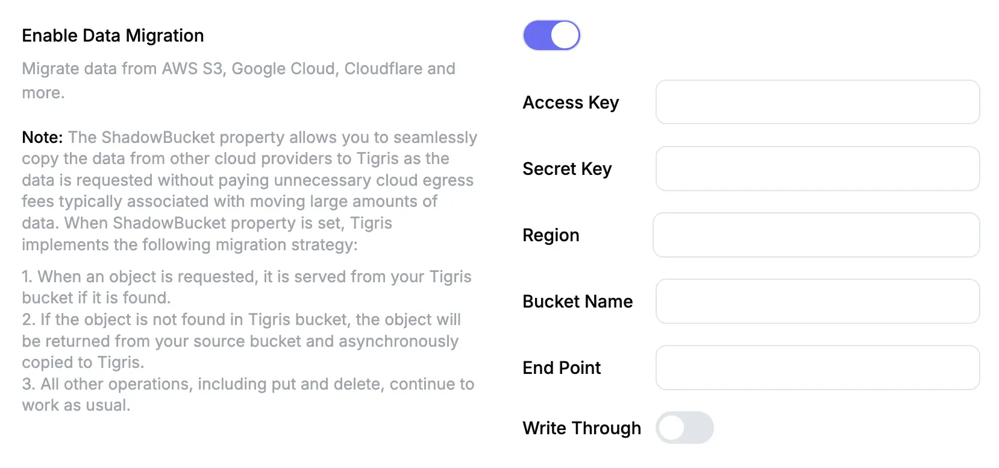

# Data Migration

Tigris supports a _lazy migration_ approach that minimizes upfront data transfer
and allows you to seamlessly adopt Tigris without disrupting existing workflows.
Once you've specified your **shadow bucket**—the source S3-compatible
bucket—Tigris automatically begins handling requests in a way that ensures data
is gradually migrated as it is accessed. Common S3-compatible storage options
include AWS S3, Google Cloud Storage (GCS), and Cloudflare R2, all of which work
seamlessly with Tigris.

This approach is ideal for large-scale migrations where copying all data at once
would be time-consuming or cost-prohibitive due to egress fees. Instead of
migrating everything up front, Tigris fetches objects from the shadow bucket
only when requested and copies them into your Tigris bucket asynchronously. This
ensures that only actively used data is migrated, reducing both latency and
cost.

If you enable the optional `write-through` setting, Tigris writes all new
objects to both the shadow bucket and the Tigris bucket. This keeps the shadow
bucket up to date and allows for a gradual, reversible migration path that gives
you full control over the timing of a complete cutover. This strategy is
especially useful for hybrid or multi-cloud setups where eliminating
**downtime** is essential.

Here’s how Tigris handles data migration under the hood:

- When an object is requested, we first check the Tigris bucket. If it’s not
  found, we fetch it from the shadow bucket, return it, and asynchronously copy
  it to Tigris for future access.
- When uploading an object, it’s first written to the shadow bucket, then copied
  to the Tigris bucket to ensure the data is available in the shadow bucket and
  eventually consistent in the Tigris bucket.
- Objects in the Tigris bucket are stored in the region closest to the user.
- When an object is deleted, it’s removed from both the Tigris and shadow
  buckets.

## Enable Data Migration in the Tigris Dashboard

To enable data migration from a S3-Compatible bucket:

- Go to the [Tigris Dashboard](https://console.tigris.dev).
- Click on `Buckets` in the left menu.
- Click on the bucket to which you wish to migrate data.
- Click `Settings`.
- Find the `Enable Data Migration` setting and enable the toggle.
- Provide the access details for your source bucket, or `Shadow Bucket`.



<!-- prettier-ignore -->
:::note

Though Tigris supports a
[single global endpoint](https://www.tigrisdata.com/docs/overview/#features-of-tigris),
other storage services may require you to specify a regional endpoint. You can
find documentation on which endpoint to utilize here:

- [AWS S3 Endpoint Documentation](https://docs.aws.amazon.com/general/latest/gr/s3.html)
  generally uses `https://s3.<region>.amazonaws.com`
- [Google Cloud Storage Endpoint Documentation](https://cloud.google.com/storage/docs/request-endpoints)
  generally uses `https://storage.googleapis.com`
  <!-- prettier-ignore -->
  :::

## Copying object ACLs

By default, migrated objects inherit the access control settings of the bucket
to which they are migrated. However, if the bucket is configured to
[allow object ACLs](/docs/objects/acl.md#enabling-object-acls), the migration
process will copy object ACLs from the shadow bucket to the Tigris bucket. The
following rules apply:

- Tigris bucket is private:
  - Public S3 objects will be migrated as public and have explicit `public-read`
    ACL set.
  - Private S3 objects will be migrated as private and inherit bucket ACL.
- Tigris bucket is public:
  - Public S3 objects will be migrated as public and inherit bucket ACL.
  - Private S3 objects will be copied as private and have explicit `private` ACL
    set.

## Migrate from Amazon Simple Storage Service (S3)

### Use a new Tigris bucket for data migration

When creating a new Tigris bucket, you can specify the source bucket from where
the data is migrated. We call this the shadow bucket. This is how you can create
a new Tigris bucket with an AWS S3 shadow bucket using `flyctl`:

```bash
flyctl storage create -n {{tigris-bucket-name}} -o {{your-fly-org}} \
	--shadow-access-key {{s3_access_key}} --shadow-secret-key {{s3_secret_key}} \
	--shadow-endpoint https://s3.us-east-1.amazonaws.com --shadow-region us-east-1 \
	--shadow-name {{your-s3-bucket}} --shadow-write-through
```

This command will create a new bucket `tigris-bucket-name` in the organization
`your-fly-org` and will migrate the data from the S3 bucket `your-s3-bucket` as
data is requested.

The endpoint and region are provider specific and should be set accordingly. You
can find the endpoint and region for AWS S3 in the
[AWS documentation](https://docs.aws.amazon.com/general/latest/gr/s3.html).

### Use an existing Tigris bucket for data migration

You can also migrate the data to an existing Tigris bucket. This is how you can
update an existing bucket to use the shadow bucket feature using `flyctl`:

```bash
flyctl storage update {{tigris-bucket-name}} \
	--shadow-access-key {{s3_access_key}} --shadow-secret-key {{s3_secret_key}} \
	--shadow-endpoint https://s3.us-east-1.amazonaws.com --shadow-region us-east-1 \
	--shadow-name {{your-s3-bucket}} --shadow-write-through
```

This command will update the bucket `tigris-bucket-name` settings so that Tigris
will migrate the data from the S3 bucket `your-s3-bucket` as data is requested.

### Finishing the migration

Once you are confident that all the objects have been migrated, you can stop the
migration by removing the shadow bucket from the bucket settings. This will stop
the objects from being read from or written to the shadow bucket. Any subsequent
requests will only read from and write to the Tigris bucket.

```bash
flyctl storage update {{tigris-bucket-name}} --clear-shadow
```

## Migrate from Google Cloud Storage (GCS)

### Use a new Tigris bucket for data migration

When creating a new Tigris bucket, you can specify the source bucket from where
the data is migrated. We call this the shadow bucket. This is how you can create
a new Tigris bucket with an GCS shadow bucket using `flyctl`:

```bash
flyctl storage create -n {{to-be-created-tigris-bucket-name}} -o {{your-fly-org}} \
--shadow-access-key {{gcs_access_key}} --shadow-secret-key {{gcs_secret_key}} \
--shadow-endpoint https://storage.googleapis.com --shadow-region auto \
--shadow-name {{gcs-bucket-name}} --shadow-write-through
```

GCS does not require a region, so the command sets the `--shadow-region` as
`auto` and uses the general endpoint, `https://storage.googleapis.com`.

### Use an existing Tigris bucket for data migration

You can also migrate the data to an existing Tigris bucket. This is how you can
update an existing bucket to use the shadow bucket feature using `flyctl`:

```bash
flyctl storage update {{tigris-bucket-name}} \
	--shadow-access-key {{gcs_access_key}} --shadow-secret-key {{gcs_secret_key}} \
	--shadow-endpoint https://storage.googleapis.com --shadow-region auto \
	--shadow-name {{gcs-bucket-name}} --shadow-write-through
```

This command will update the bucket `tigris-bucket-name` settings so that Tigris
will migrate the data from the GCS bucket `gcs-bucket-name` as data is
requested.

### Create Google Cloud Storage Access Keys for Migration

To migrate data from Google Cloud Storage (GCS) to an S3-compatible service like
Tigris, you'll need to generate **HMAC credentials** (access key and secret key)
for a GCS service account:

- Go to the
  [Google Cloud Console Interoperability page](https://console.cloud.google.com/storage/settings;tab=interoperability).
- If you don’t already have a service account with access to your GCS bucket,
  create one in the
  [IAM & Admin section](https://console.cloud.google.com/iam-admin/serviceaccounts)
  and assign it the necessary permissions (such as `Storage Object Viewer`,
  `Storage Object Admin`, or `Storage Admin`).
- On the Interoperability page, find the service account and click `Create Key`
  under the `HMAC Keys` section to generate an access key and secret.
- Copy and securely store the access key and secret key for use when configuring
  Tigris.
- Make sure the service account has permission to access the GCS bucket you want
  to migrate from.

### Finishing the migration

Once you are confident that all the objects have been migrated, you can stop the
migration by removing the shadow bucket configuration. This will stop the
objects from being read from or written to the shadow bucket. Any subsequent
requests will only read from and write to the Tigris bucket.

```bash
flyctl storage update {{tigris-bucket-name}} --clear-shadow
```

## Migrate from Cloudflare R2

### Use a new Tigris bucket for data migration

When creating a new Tigris bucket, you can specify the source bucket from where
the data is migrated. We call this the shadow bucket. This is how you can create
a new Tigris bucket with a Cloudflare R2 shadow bucket using `flyctl`:

```bash
flyctl storage create -n {{to-be-created-tigris-bucket-name}} -o {{your-fly-org}} \
--shadow-access-key {{r2_access_key}} --shadow-secret-key {{r2_secret_key}} \
--shadow-endpoint https://{{account-id}}.r2.cloudflarestorage.com --shadow-region auto \
--shadow-name {{r2-bucket-name}} --shadow-write-through
```

Cloudflare R2 uses a custom endpoint format that includes your account ID.
Replace `account-id` with your Cloudflare account ID. R2 does not require a
specific region, so `--shadow-region` is set to `auto`.

### Use an existing Tigris bucket for data migration

You can also migrate the data to an existing Tigris bucket. This is how you can
update an existing bucket to use the shadow bucket feature using `flyctl`:

```bash
flyctl storage update {{tigris-bucket-name}} \
  --shadow-access-key {{r2_access_key}} --shadow-secret-key {{r2_secret_key}} \
  --shadow-endpoint https://{{account-id}}.r2.cloudflarestorage.com --shadow-region auto \
  --shadow-name {{r2-bucket-name}} --shadow-write-through
```

This command updates the `tigris-bucket-name` settings so that Tigris will
migrate data from the Cloudflare R2 bucket `r2-bucket-name` as data is
requested.

### Finishing the migration

Once you are confident that all the objects have been migrated, you can stop the
migration by removing the shadow bucket configuration. This will stop the
objects from being read from or written to the shadow bucket. Any subsequent
requests will only read from and write to the Tigris bucket.

```bash
flyctl storage update {{tigris-bucket-name}} --clear-shadow
```
