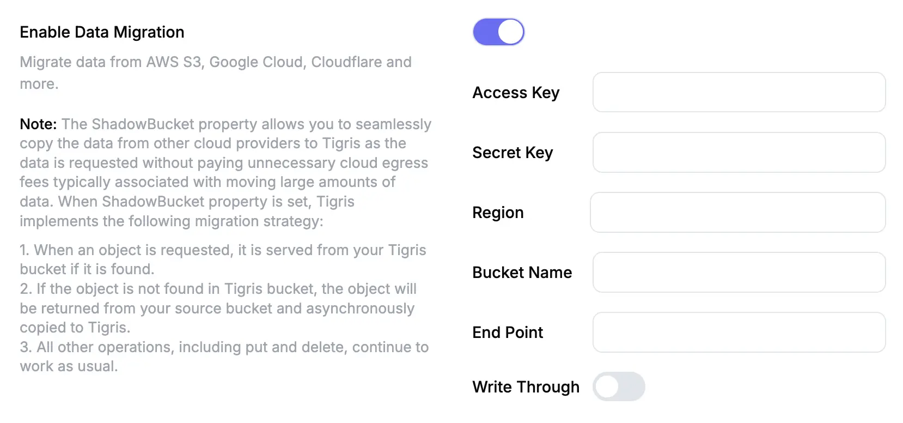

# Migrate to Tigris Object Storage

Tigris supports zero-downtime migration from any S3-compatible storage provider
using shadow buckets. Data is migrated lazily as it's accessed, so there's no
need for a large upfront data transfer. With write-through mode enabled, new
writes are synced back to your old bucket, so you can take as long as you need
to complete the migration.

## Provider-specific guides

- [Migrate from AWS S3](/docs/migration/aws-s3)
- [Migrate from Google Cloud Storage](/docs/migration/gcs)
- [Migrate from Cloudflare R2](/docs/migration/cloudflare-r2)
- [Migrate from MinIO](/docs/migration/minio)
- [Migrate from any S3-compatible storage](/docs/migration/s3-compatible)
  (Backblaze B2, DigitalOcean Spaces, Wasabi, Hetzner, Vultr, Linode, and
  others)

## How shadow bucket migration works

Once you've specified your **shadow bucket** (the source S3-compatible bucket),
Tigris handles requests so that data is gradually migrated as it is accessed.

This approach works well for large-scale migrations where copying all data at
once would be slow or expensive. Instead of migrating everything up front,
Tigris fetches objects from the shadow bucket only when requested and copies
them into your Tigris bucket asynchronously. Only actively used data is
migrated, reducing both latency and cost.

## Write-through mode: migrate at your own pace

Most migration tools force a hard cutover: you copy your data, switch over, and
hope nothing breaks. Tigris takes a different approach.

With the optional **write-through** setting enabled, Tigris syncs all new writes
back to your original bucket. Your old bucket stays up to date with every new
object, update, and delete. This means you can run on Tigris in production while
keeping your previous storage provider fully current.

There's no deadline to finish the migration. You can run in write-through mode
for days, weeks, or months while you verify that everything works. If you need
to roll back, your old bucket has all the latest data. When you're ready, turn
off write-through and decommission the old bucket.

Under the hood:

- When an object is requested, Tigris checks its own bucket first. If the object
  is not found, Tigris fetches it from the shadow bucket, returns it, and
  asynchronously copies it for future access.
- When uploading an object, it's first written to the shadow bucket, then copied
  to the Tigris bucket to ensure data is available in both locations.
- Objects in the Tigris bucket are stored in the region closest to the user.
- When an object is deleted, it's removed from both the Tigris and shadow
  buckets.

<!-- prettier-ignore -->
:::note
Object listing behavior depends on whether write-through mode is
enabled. When write-through is enabled, the list API returns the full contents
of the shadow bucket. When write-through is disabled, the list API only includes
objects that have already been migrated into Tigris; objects that exist solely
in the shadow bucket are not listed until they are accessed and migrated.

  <!-- prettier-ignore -->

:::

## Enable Data Migration in the Tigris Dashboard

To enable data migration from any S3-compatible bucket:

- Go to the [Tigris Dashboard](https://console.tigris.dev).
- Click on `Buckets` in the left menu.
- Click on the bucket to which you wish to migrate data.
- Click `Settings`.
- Find the `Enable Data Migration` setting and enable the toggle.
- Provide the access details for your source bucket, or `Shadow Bucket`.

<!-- prettier-ignore -->
:::note

Though Tigris supports a
[single global endpoint](https://www.tigrisdata.com/docs/overview/#features-of-tigris),
other storage services may require you to specify a regional endpoint. See the
provider-specific guides above for the correct endpoint format.

<!-- prettier-ignore -->
:::

If the storage service does not require a region, set the region to `auto` in
the `Enable Data Migration` settings. For example, GCS and Cloudflare R2 do not
require a region to be set, and therefore use `auto`.

## Copying object ACLs

By default, migrated objects inherit the access control settings of the bucket
to which they are migrated. However, if the bucket is configured to
[allow object ACLs](/docs/objects/acl.md#enabling-object-acls), the migration
process will copy object ACLs from the shadow bucket to the Tigris bucket. The
following rules apply:

- Tigris bucket is private:
  - Public S3 objects will be migrated as public and have explicit `public-read`
    ACL set.
  - Private S3 objects will be migrated as private and inherit bucket ACL.
- Tigris bucket is public:
  - Public S3 objects will be migrated as public and inherit bucket ACL.
  - Private S3 objects will be copied as private and have explicit `private` ACL
    set.
