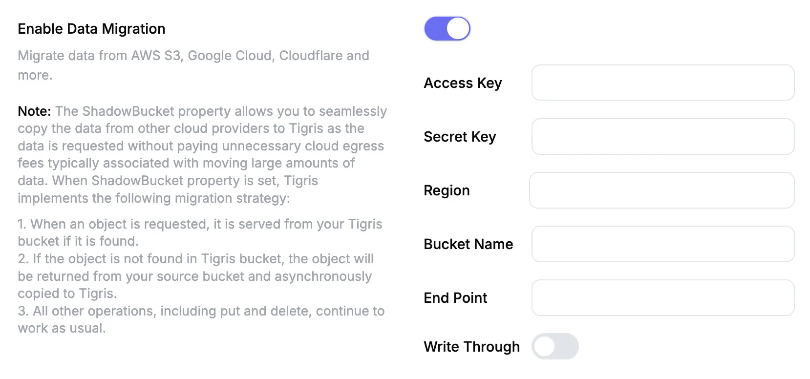

import Tabs from "@theme/Tabs";
import TabItem from "@theme/TabItem";

# Migrate to Tigris Object Storage

Tigris supports zero-downtime migration from any S3-compatible storage provider
with shadow buckets. Tigris migrates data lazily as clients access it. This
removes the need for a large upfront data transfer. When you enable
write-through mode, Tigris syncs new writes back to your old bucket. You can
take as long as you need to complete the migration.

<!-- prettier-ignore -->
:::note
The shadow bucket source must be S3-compatible. Azure Blob Storage is not
S3-compatible, so you cannot use it as a shadow bucket source directly. To
migrate from Azure Blob Storage, you must front it with an S3-compatible shim
such as [s3proxy](https://github.com/gaul/s3proxy). You then point the shadow
bucket at that S3 endpoint. See the
[Azure Blob Storage guide](/docs/migration/azure-blob) for the steps.
:::

## Provider-specific guides

- [Migrate from AWS S3](/docs/migration/aws-s3)
- [Migrate from Google Cloud Storage](/docs/migration/gcs)
- [Migrate from Cloudflare R2](/docs/migration/cloudflare-r2)
- [Migrate from MinIO](/docs/migration/minio)
- [Migrate from any S3-compatible storage](/docs/migration/s3-compatible)
  (Backblaze B2, DigitalOcean Spaces, Wasabi, Hetzner, Vultr, Linode, and
  others)
- [Migrate from Azure Blob Storage](/docs/migration/azure-blob) (via an s3proxy
  S3 shim)

## How shadow bucket migration works

After you specify your **shadow bucket** (the source S3-compatible bucket),
Tigris handles requests and migrates data gradually as clients access it.

This approach works well for large-scale migrations, where copying all data at
once can be slow or expensive. Instead of migrating everything up front, Tigris
fetches objects from the shadow bucket only when a client requests them. Tigris
copies the objects into your Tigris bucket asynchronously. Tigris migrates only
actively used data. This reduces both latency and cost.

## Write-through mode: migrate at your own pace

Most migration tools force a hard cutover: you copy your data, switch over, and
hope nothing breaks. Tigris takes a different approach.

With the optional **write-through** mode enabled, Tigris syncs all new writes
back to your original bucket. Your old bucket stays up to date with every new
object, update, and delete. This means you can run on Tigris in production while
keeping your previous storage provider fully current.

There is no deadline to finish the migration. You can run in write-through mode
for days, weeks, or months while you make sure that everything works. If you
need to roll back, your old bucket has all the latest data. When you are ready,
turn off write-through and decommission the old bucket.

Internally, Tigris does the following:

- When a client requests an object, Tigris checks its own bucket first. If
  Tigris does not find the object, it fetches the object from the shadow bucket,
  returns the object, and copies it asynchronously for future access.
- When a client uploads an object with write-through enabled, Tigris writes it
  to the shadow bucket and the Tigris bucket at the same time. This keeps both
  buckets in sync.
- Tigris stores objects in the Tigris bucket in the region closest to the user.
- When a client deletes an object, Tigris removes it from both the Tigris bucket
  and the shadow bucket.

{/* prettier-ignore */}
:::note

Object listing behavior depends on whether you enable or disable write-through
mode.

When you enable write-through mode, the list API returns the full contents of
the shadow bucket.

When you disable write-through mode, the list API includes only the objects that
are already in the Tigris bucket. The API does not list objects that exist only
in the shadow bucket. Tigris lists these objects only after a client accesses
them and Tigris migrates them.

{/* prettier-ignore */}
:::

## Enable Data Migration

Configure the shadow bucket from the Tigris Dashboard or the CLI. See the
[provider-specific guides](#provider-specific-guides) above for the exact
endpoint, region, and credential format for your source.

<Tabs>
<TabItem value="dashboard" label="Dashboard" default>

To enable data migration from any S3-compatible bucket:

- Go to the [Tigris Dashboard](https://console.storage.dev).
- Click on `Buckets` in the left menu.
- Click on the bucket to which you wish to migrate data.
- Click `Settings`.
- Find `Enable Data Migration` and turn on the toggle.
- Enter the access details for your source bucket, or `Shadow Bucket`.



If the storage service does not require a region, set the region to `auto`. For
example, GCS and Cloudflare R2 use `auto`.

</TabItem>
<TabItem value="cli" label="CLI">

The CLI flow is two commands: configure the shadow source, then optionally drain
it.

**1. Configure the shadow bucket** with
[`tigris buckets set-migration`](/docs/cli/buckets/set-migration):

```bash
tigris buckets set-migration my-bucket \
  --bucket source-bucket \
  --endpoint https://<source-endpoint> \
  --region <source-region> \
  --access-key <key> \
  --secret-key <secret>
```

Add `--write-through` to enable write-through mode, or `--disable` to clear the
migration configuration.

**2. Actively migrate (optional).** Lazy migration only copies objects when a
client accesses them. To migrate every remaining object server-side, run
[`tigris buckets migrate`](/docs/cli/buckets/migrate):

```bash
# Migrate every unmigrated object in the bucket
tigris buckets migrate my-bucket

# Migrate only objects under a key prefix
tigris buckets migrate my-bucket/images/
```

The command runs in the foreground and reports progress as it goes.

</TabItem>
</Tabs>

## Copying object ACLs

By default, Tigris configures access control on migrated objects to match the
destination bucket. However, if you configure the bucket to
[allow object ACLs](/docs/objects/acl.md#enabling-object-acls), Tigris copies
object ACLs during migration. Tigris copies these ACLs from the shadow bucket to
the Tigris bucket. The following rules apply:

- Tigris bucket is private:
  - Tigris migrates public S3 objects as public objects and sets an explicit
    `public-read` ACL.
  - Tigris migrates private S3 objects as private objects. These objects inherit
    the bucket ACL.
- Tigris bucket is public:
  - Tigris migrates public S3 objects as public objects. These objects inherit
    the bucket ACL.
  - Tigris copies private S3 objects as private objects and sets an explicit
    `private` ACL.
