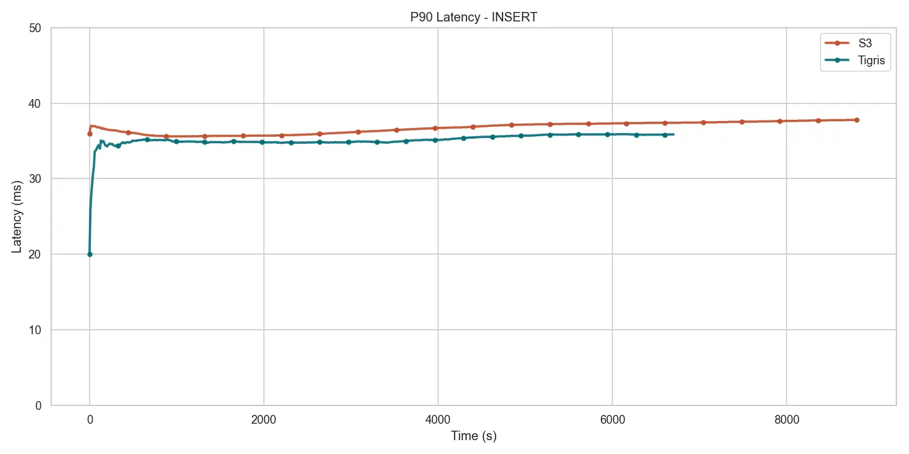
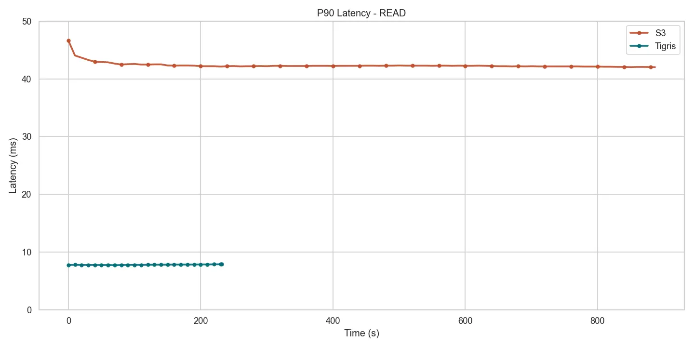
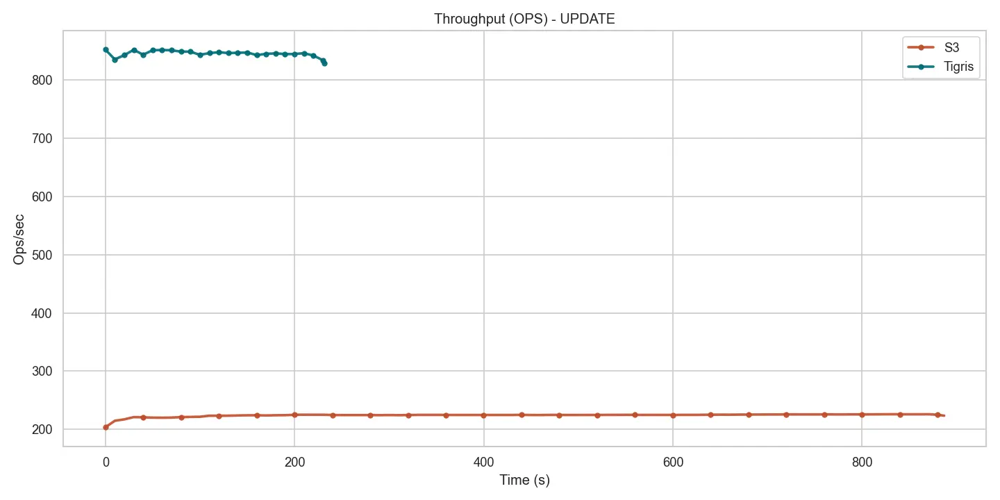
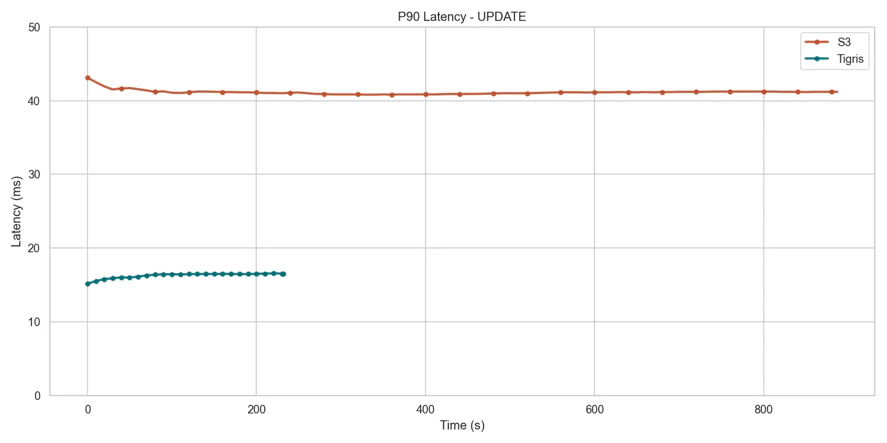

# Comparison: AWS S3

export const MetricCell = ({
  serviceValue,
  tigrisValue,
  unit,
}) => {
  const diffMultiple = serviceValue / tigrisValue;
  const multiple = Math.round(diffMultiple * 100) / 100;

return ( 
 

{serviceValue} {unit} 
 
 ({multiple}x Tigris) 

 ); };

export const B = ({ t, unit }) => (
  

    

      {t} {unit}
    

  

);

export const R = ({ t }) => (
  

    
{t}

  

);

export const M = ({ t, s }) => (
  <MetricCell tigrisValue={t} serviceValue={s} unit="ms" />
);

export const S = ({ t, s }) => (
  <MetricCell tigrisValue={t} serviceValue={s} unit="sec" />
);

export const O = ({ t, s }) => (
  <MetricCell tigrisValue={t} serviceValue={s} unit="ops/sec" />
);

## Summary

For small object workloads (1 KB objects), Tigris achieves approximately **4x
the throughput** of AWS S3 for both read and write operations, with
significantly lower latency across all metrics.

## Load Phase Results

Loading 10 million 1 KB objects into each system.

| Metric               | Tigris                          | AWS S3                      |
| -------------------- | ------------------------------- | --------------------------- |
| <R t="P50 Latency"/> | <B t={16.799} unit="ms" />      | <M t={16.799} s={25.743} /> |
| <R t="P90 Latency"/> | <B t={35.871} unit="ms" />      | <M t={35.871} s={37.791} /> |
| <R t="Runtime"/>     | <B t={6710.7} unit="sec" />     | <S t={6710.7} s={8826.4} /> |
| <R t="Throughput"/>  | <B t={1490.2} unit="ops/sec" /> | <O t={1490.2} s={1133.0} /> |

Tigris finishes the load in **6711 seconds**, roughly **31% faster than S3 (8826
seconds)**.

_PUT p90 latency during load phase_

## Mixed Workload Results

1 million operations with 80% reads and 20% writes.

### Read Performance

| Metric               | Tigris                          | AWS S3                     |
| -------------------- | ------------------------------- | -------------------------- |
| <R t="P50 Latency"/> | <B t={5.399} unit="ms" />       | <M t={5.399} s={22.415} /> |
| <R t="P90 Latency"/> | <B t={7.867} unit="ms" />       | <M t={7.867} s={42.047} /> |
| <R t="Runtime"/>     | <B t={241.7} unit="sec" />      | <S t={241.7} s={896.8} />  |
| <R t="Throughput"/>  | <B t={3309.8} unit="ops/sec" /> | <O t={3309.8} s={891.5} /> |

Tigris sustains **≈3.3k ops/s**, nearly **4x S3 (≈892 ops/s)** for read
operations.

_Read throughput during mixed workload_

_Read p90 latency during mixed workload_

### Write Performance

| Metric               | Tigris                         | AWS S3                      |
| -------------------- | ------------------------------ | --------------------------- |
| <R t="P50 Latency"/> | <B t={12.855} unit="ms" />     | <M t={12.855} s={26.975} /> |
| <R t="P90 Latency"/> | <B t={16.543} unit="ms" />     | <M t={16.543} s={41.215} /> |
| <R t="Runtime"/>     | <B t={241.6} unit="sec" />     | <S t={241.6} s={896.8} />   |
| <R t="Throughput"/>  | <B t={828.1} unit="ops/sec" /> | <O t={828.1} s={223.6} />   |

Tigris delivers **≈828 ops/s**, close to **4x S3 (224 ops/s)** for write
operations.

_Write throughput during mixed workload_

_Write p90 latency during mixed workload_

## Key Takeaways

- **4x faster throughput** for both reads and writes
- **Sub-10ms read latency** vs S3's 42ms p90
- **Sub-20ms write latency** vs S3's 41ms p90
- **31% faster bulk loads** for large datasets

## Next Steps

- [Comparison: Cloudflare R2](./cloudflare-r2.mdx)
- [Benchmark Summary](./summary.mdx)
