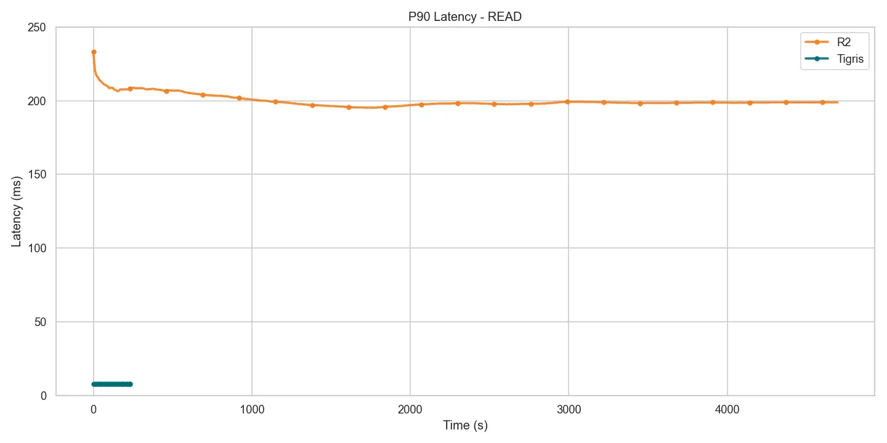
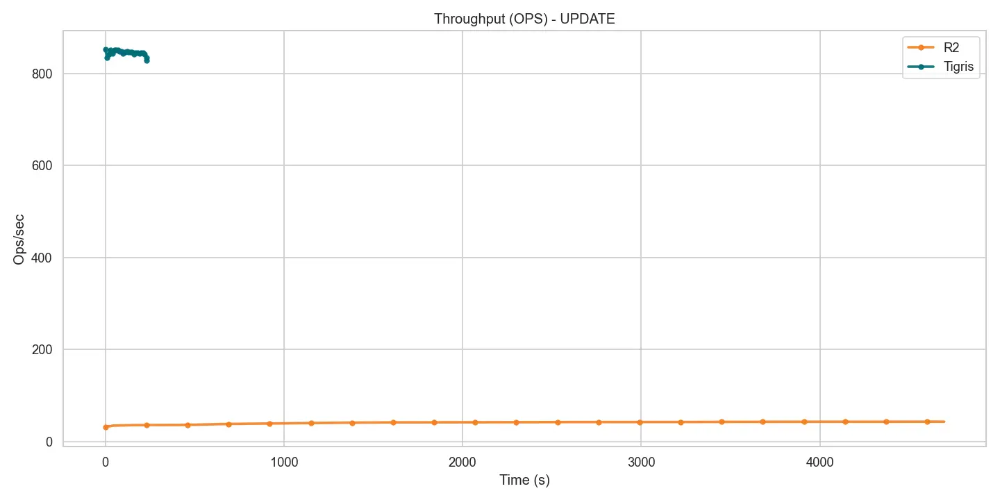
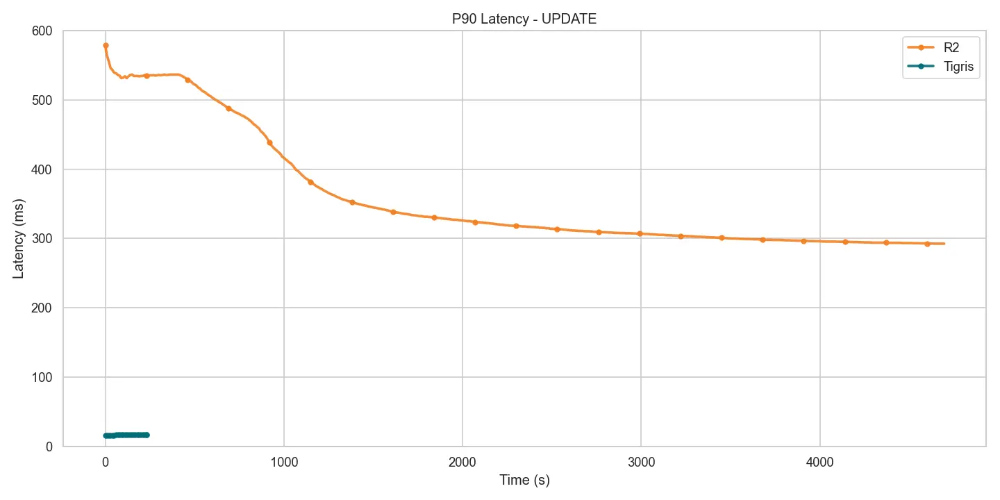

# Comparison: Cloudflare R2

export const MetricCell = ({
  serviceValue,
  tigrisValue,
  unit,
}) => {
  const diffMultiple = serviceValue / tigrisValue;
  const multiple = Math.round(diffMultiple * 100) / 100;

return ( 
 

{serviceValue} {unit} 
 
 ({multiple}x Tigris) 

 ); };

export const B = ({ t, unit }) => (
  

    

      {t} {unit}
    

  

);

export const R = ({ t }) => (
  

    
{t}

  

);

export const M = ({ t, s }) => (
  <MetricCell tigrisValue={t} serviceValue={s} unit="ms" />
);

export const S = ({ t, s }) => (
  <MetricCell tigrisValue={t} serviceValue={s} unit="sec" />
);

export const O = ({ t, s }) => (
  <MetricCell tigrisValue={t} serviceValue={s} unit="ops/sec" higherIsBetter />
);

## Summary

For small object workloads (1 KB objects), Tigris achieves approximately **20x
the throughput** of Cloudflare R2 for both read and write operations. R2
exhibits extremely high latency for small objects, making Tigris the clear
winner for this use case.

## Load Phase Results

Loading 10 million 1 KB objects into each system.

| Metric               | Tigris                          | Cloudflare R2                |
| -------------------- | ------------------------------- | ---------------------------- |
| <R t="P50 Latency"/> | <B t={16.799} unit="ms" />      | <M t={16.799} s={197.119} /> |
| <R t="P90 Latency"/> | <B t={35.871} unit="ms" />      | <M t={35.871} s={340.223} /> |
| <R t="Runtime"/>     | <B t={6710.7} unit="sec" />     | <S t={6710.7} s={72063} />   |
| <R t="Throughput"/>  | <B t={1490.2} unit="ops/sec" /> | <O t={1490.2} s={138.8} />   |

R2's p90 PUT latency tops **340ms** whereas Tigris stays below **36ms**. This
extreme latency difference means Tigris finishes the load in **6711 seconds**
while R2 requires **72063 seconds** (over 20 hours).

_Total load time for loading 10M 1 KB objects_

## Mixed Workload Results

1 million operations with 80% reads and 20% writes.

### Read Performance

| Metric               | Tigris                          | Cloudflare R2               |
| -------------------- | ------------------------------- | --------------------------- |
| <R t="P50 Latency"/> | <B t={5.399} unit="ms" />       | <M t={5.399} s={605.695} /> |
| <R t="P90 Latency"/> | <B t={7.867} unit="ms" />       | <M t={7.867} s={680.959} /> |
| <R t="Runtime"/>     | <B t={241.7} unit="sec" />      | <S t={241.7} s={4705.3} />  |
| <R t="Throughput"/>  | <B t={3309.8} unit="ops/sec" /> | <O t={3309.8} s={42.6} />   |

Tigris sustains **≈3.3k ops/s**, approximately **78x R2 (≈43 ops/s)** for read
operations.

_Read throughput during mixed workload_

_Read p90 latency during mixed workload_

### Write Performance

| Metric               | Tigris                         | Cloudflare R2                |
| -------------------- | ------------------------------ | ---------------------------- |
| <R t="P50 Latency"/> | <B t={12.855} unit="ms" />     | <M t={12.855} s={605.695} /> |
| <R t="P90 Latency"/> | <B t={16.543} unit="ms" />     | <M t={16.543} s={680.959} /> |
| <R t="Runtime"/>     | <B t={241.6} unit="sec" />     | <S t={241.6} s={4705.3} />   |
| <R t="Throughput"/>  | <B t={828.1} unit="ops/sec" /> | <O t={828.1} s={42.6} />     |

Tigris delivers **≈828 ops/s**, approximately **20x R2 (≈43 ops/s)** for write
operations.

_Write throughput during mixed workload_

_Write p90 latency during mixed workload_

## Key Takeaways

- **20x faster throughput** for both reads and writes
- **Sub-10ms read latency** vs R2's 680ms p90
- **Sub-20ms write latency** vs R2's 680ms p90
- **10x faster bulk loads** for large datasets
- R2 is not optimized for small object workloads

## Next Steps

- [Comparison: AWS S3](./aws-s3)
- [Benchmark Summary](./summary)
