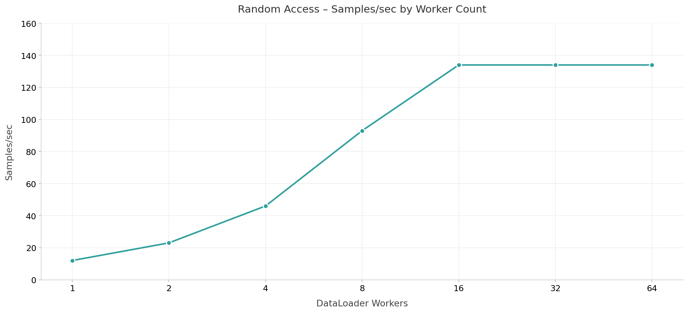
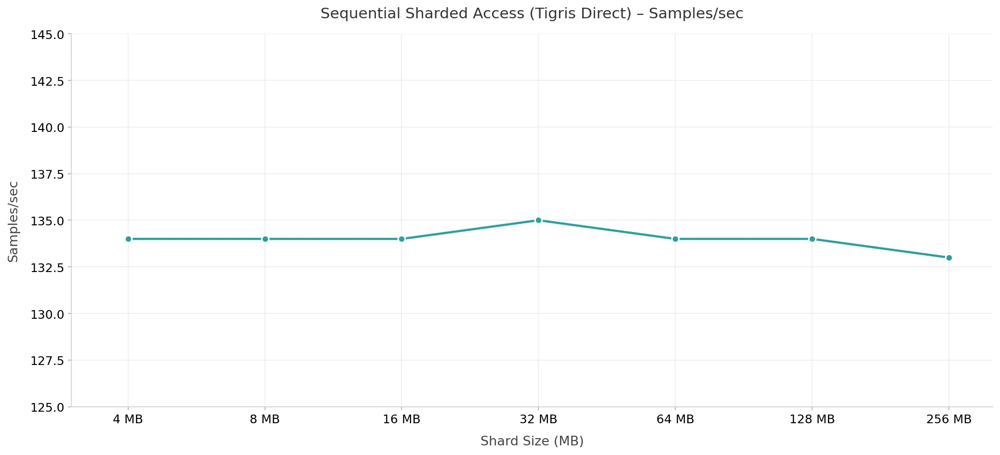
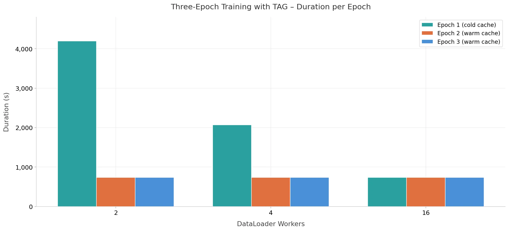
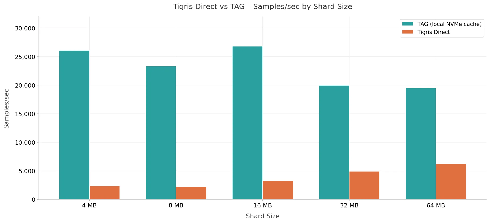

# Model Training on Tigris

Training ML models directly from object storage works if the data pipeline can
keep up. We
[benchmarked](https://www.tigrisdata.com/blog/training-object-storage) Tigris
against
[AWS S3](https://aws.amazon.com/blogs/machine-learning/applying-data-loading-best-practices-for-ml-training-with-amazon-s3-clients/)
on a standard image classification workload (ViT on 100k JPEGs, g5.8xlarge),
then tested what changes when you add **TAG (Tigris Acceleration Gateway)**, a
local S3-compatible caching proxy.

## Summary

Tigris reaches ~99% GPU utilization with ~134 samples/sec at saturation, which
is within 3% of the
[~138 samples/sec AWS reported](https://aws.amazon.com/blogs/machine-learning/applying-data-loading-best-practices-for-ml-training-with-amazon-s3-clients/)
on the same workload. With TAG's warm cache, warm epochs are **5.7x faster** and
you need **4 workers instead of 16** to saturate the GPU. At peak entitlement,
TAG's local cache delivers **~200x** the throughput the GPU can consume.

## How we ran the benchmarks

| Component | Specification                                                                                                                                                                                                                                               |
| --------- | ----------------------------------------------------------------------------------------------------------------------------------------------------------------------------------------------------------------------------------------------------------- |
| Instance  | g5.8xlarge (NVIDIA A10G, 32 vCPUs), us-east-1                                                                                                                                                                                                               |
| Dataset   | 100,000 JPEG images (~115 KB each, ~10 GB total)                                                                                                                                                                                                            |
| Model     | ViT (Vision Transformer)                                                                                                                                                                                                                                    |
| Tool      | [S3 Connector for PyTorch](https://github.com/tigrisdata/s3-connector-for-pytorch), same benchmark suite as the [AWS reference](https://aws.amazon.com/blogs/machine-learning/applying-data-loading-best-practices-for-ml-training-with-amazon-s3-clients/) |

## 1. Tigris matches AWS S3 on raw images from object storage

Each training image is stored as its own object in S3. The dataloader fetches
one object at a time over the network, so that means a lot of waiting. The GPU
has to wait too, because it only gets data when the dataloader delivers it.

You can hide that wait time by running more workers. Each worker fetches images
in parallel, so more workers means more images per second. The graph below shows
how throughput grows as you add workers. With 1 worker you get about 12
samples/sec, with 8 workers you get about 93. At 16 workers, throughput flattens
at ~134 samples/sec, and the GPU is now the limit, not the network. Tigris
reaches the
[same saturation point as AWS S3](https://aws.amazon.com/blogs/machine-learning/applying-data-loading-best-practices-for-ml-training-with-amazon-s3-clients/)
on this workload.

**Fig. 1.** Throughput (samples/sec) vs. DataLoader worker count, and adding
workers increases throughput until the GPU is saturated at 16 workers.

## 2. Sharding halves the worker count

Packing images into tar shards lets the dataloader issue a single GET request
and stream many samples sequentially, shifting from latency-bound to
bandwidth-bound. We swept shard sizes from 4 MB to 256 MB with 8 workers.

| Shard Size | Samples/sec | Duration (s) | GPU Util (%) |
| ---------: | ----------: | -----------: | -----------: |
|       4 MB |        ~134 |        736.6 |         99.2 |
|       8 MB |        ~134 |        736.1 |         99.3 |
|      16 MB |        ~134 |        736.3 |         99.3 |
|      32 MB |        ~135 |        735.0 |         99.4 |
|      64 MB |        ~134 |        736.6 |         99.4 |
|     128 MB |        ~134 |        737.1 |         99.3 |
|     256 MB |        ~133 |        739.1 |         99.2 |

All sizes deliver ~134 samples/sec at ~99% GPU utilization. The key difference
is worker count: sequential sharded access saturates the GPU at 8 workers,
compared to 16 for random access. Sharding amortizes per-object TTFB overhead,
so fewer workers are needed to keep the GPU fed.

**Fig. 2.** Samples/sec by shard size with 8 workers (Tigris direct).

## 3. TAG eliminates network latency after epoch 1

TAG runs on the same machine as your training job. It sits between your app and
S3. When the dataloader requests an object, TAG checks its local NVMe cache
first. If the object is there, TAG serves it immediately. If not, TAG fetches
from S3, stores it in the cache, and returns it to your app.

The first epoch is cold: every object is a cache miss, so TAG fetches from S3
and the network is still the bottleneck. After that, the cache is warm. Epochs 2
and 3 read every object from local NVMe, so there are no network round-trips.

| Metric                      | Cold (Epoch 1) | Warm (Epoch 2+) |
| --------------------------- | -------------- | --------------- |
| Epoch duration (2 workers)  | 4,197s         | 734s            |
| Speedup (2 workers)         | —              | 5.7x faster     |
| Workers to saturate the GPU | 16 (no cache)  | 4 (warm cache)  |

Three things happen when you add TAG:

- **Warm epochs are 5.7x faster.** At 2 workers, epoch 1 (cold) takes 4,197s,
  and epochs 2 and 3 take ~734s each.
- **Fewer workers needed.** With a warm cache, 4 workers saturate the GPU, and
  without caching, that takes 16.
- **No data sharding.** With TAG's warm cache, raw unsharded images achieve the
  same GPU saturation as sharded sequential access.

**Fig. 3.** Epoch duration (seconds) across three training epochs with TAG.

## 4. 200x headroom: storage is never the bottleneck

During normal training, the GPU is busy computing. That makes it hard to see how
fast the data pipeline can run. We swapped ViT for a no-op model that does no
computation. The pipeline just feeds samples as fast as it can. That gives us
the raw throughput ceiling: how many samples per second storage can deliver when
nothing else is slowing it down.

| Config                 | Workers | Throughput | Headroom over GPU |
| ---------------------- | ------: | ---------- | ----------------- |
| Tigris direct (64 MB)  |       8 | 6,228/sec  | 46x               |
| TAG warm cache (16 MB) |       8 | 26,820/sec | ~200x             |

The GPU is the bottleneck in a well-configured pipeline, not storage.

**Fig. 4.** Raw throughput ceiling: Tigris direct vs. TAG warm cache.

## Main findings

| Takeaway                                      | Detail                                                                                                                                                                                                     |
| --------------------------------------------- | ---------------------------------------------------------------------------------------------------------------------------------------------------------------------------------------------------------- |
| Tigris throughput matches AWS S3.             | ~134 samples/sec at saturation, within 3% of [AWS S3](https://aws.amazon.com/blogs/machine-learning/applying-data-loading-best-practices-for-ml-training-with-amazon-s3-clients/) on the same ViT workload |
| Warm cache speeds up second and third epochs. | Warm epochs run 5.7x faster than cold epochs with TAG                                                                                                                                                      |
| Fewer workers needed to saturate the GPU.     | 4 workers saturate the GPU with TAG, compared to 16 without caching                                                                                                                                        |
| Local cache larger than GPU demand.           | TAG's local NVMe cache provides ~200x headroom over what the ViT model can consume                                                                                                                         |

## What to read next

- [Full benchmark post](https://www.tigrisdata.com/blog/training-object-storage)
  — Methodology, shard-size sweeps, and per-configuration breakdowns
- [Performance Metrics](./metrics.mdx) — Benchmark methodology
- [Comparison: AWS S3](./aws-s3.mdx) — Small object workload comparison
- [Comparison: Cloudflare R2](./cloudflare-r2.mdx) — Small object workload
  comparison
- [Benchmark Summary](./summary.mdx) — Complete YCSB results
