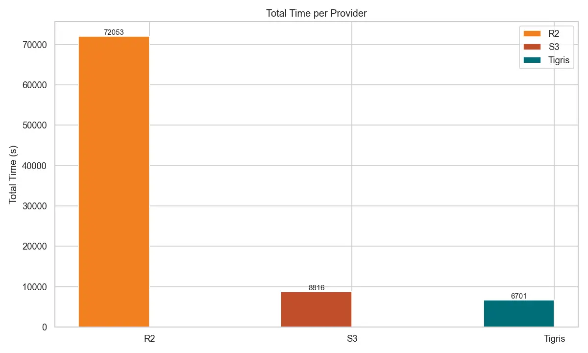

# Benchmark Summary

export const MetricCell = ({
  serviceValue,
  tigrisValue,
  unit,
}) => {
  const diffMultiple = serviceValue / tigrisValue;
  const multiple = Math.round(diffMultiple * 100) / 100;

return ( 
 

{serviceValue} {unit} 
 
 ({multiple}x Tigris) 

 ); };

export const B = ({ t, unit }) => (
  

    

      {t} {unit}
    

  

);

export const R = ({ t }) => (
  

    
{t}

  

);

export const M = ({ t, s }) => (
  <MetricCell tigrisValue={t} serviceValue={s} unit="ms" />
);

export const S = ({ t, s }) => (
  <MetricCell tigrisValue={t} serviceValue={s} unit="sec" />
);

export const O = ({ t, s }) => (
  <MetricCell tigrisValue={t} serviceValue={s} unit="ops/sec" higherIsBetter />
);

This page summarizes all benchmark results comparing Tigris with AWS S3 and
Cloudflare R2 for small object workloads (1 KB objects).

## Key Results

| Metric            | Tigris vs AWS S3 | Tigris vs Cloudflare R2 |
| ----------------- | ---------------- | ----------------------- |
| Read throughput   | **4x faster**    | **20x faster**          |
| Write throughput  | **4x faster**    | **20x faster**          |
| Read p90 latency  | **5x lower**     | **86x lower**           |
| Write p90 latency | **2.5x lower**   | **41x lower**           |
| Bulk load time    | **31% faster**   | **10x faster**          |

## Load Phase Summary

Loading 10 million 1 KB objects.

| Service          | P50 Latency (ms)             | P90 Latency (ms)             | Runtime (sec)               | Throughput (ops/sec)            |
| ---------------- | ---------------------------- | ---------------------------- | --------------------------- | ------------------------------- |
| <R t="Tigris" /> | <B t={16.799} unit="ms" />   | <B t={35.871} unit="ms" />   | <B t={6710.7} unit="sec" /> | <B t={1490.2} unit="ops/sec" /> |
| <R t="S3" />     | <M t={16.799} s={25.743} />  | <M t={35.871} s={37.791} />  | <S t={6710.7} s={8826.4} /> | <O t={1490.2} s={1133.0} />     |
| <R t="R2" />     | <M t={16.799} s={197.119} /> | <M t={35.871} s={340.223} /> | <S t={6710.7} s={72063} />  | <O t={1490.2} s={138.8} />      |

_Total load time for loading 10M 1 KB objects_

## Read Performance Summary

Mixed workload (80% read, 20% write) - 1 million operations.

| Service          | P50 Latency (ms)            | P90 Latency (ms)            | Runtime (sec)              | Throughput (ops/sec)            |
| ---------------- | --------------------------- | --------------------------- | -------------------------- | ------------------------------- |
| <R t="Tigris" /> | <B t={5.399} unit="ms" />   | <B t={7.867} unit="ms" />   | <B t={241.7} unit="sec" /> | <B t={3309.8} unit="ops/sec" /> |
| <R t="S3" />     | <M t={5.399} s={22.415} />  | <M t={7.867} s={42.047} />  | <S t={241.7} s={896.8} />  | <O t={3309.8} s={891.5} />      |
| <R t="R2" />     | <M t={5.399} s={605.695} /> | <M t={7.867} s={680.959} /> | <S t={241.7} s={4705.3} /> | <O t={3309.8} s={42.6} />       |

## Write Performance Summary

Mixed workload (80% read, 20% write) - 1 million operations.

| Service          | P50 Latency (ms)             | P90 Latency (ms)             | Runtime (sec)              | Throughput (ops/sec)           |
| ---------------- | ---------------------------- | ---------------------------- | -------------------------- | ------------------------------ |
| <R t="Tigris" /> | <B t={12.855} unit="ms" />   | <B t={16.543} unit="ms" />   | <B t={241.6} unit="sec" /> | <B t={828.1} unit="ops/sec" /> |
| <R t="S3" />     | <M t={12.855} s={26.975} />  | <M t={16.543} s={41.215} />  | <S t={241.6} s={896.8} />  | <O t={828.1} s={223.6} />      |
| <R t="R2" />     | <M t={12.855} s={605.695} /> | <M t={16.543} s={680.959} /> | <S t={241.6} s={4705.3} /> | <O t={828.1} s={42.6} />       |

## Conclusion

Tigris outperforms S3 and R2 for small object workloads. The performance
advantage stems from Tigris's optimized architecture for small objects. While S3
and R2 struggle with high latency on small payloads (R2's p90 PUT latency
reaches 340ms), Tigris maintains consistent low latency through intelligent
object inlining, key coalescing, and LSM-backed caching.

These results demonstrate that Tigris can serve as a unified storage solution
for mixed workloads, eliminating the need to maintain separate systems for small
and large objects.

These benchmarks focus on small object workloads. If your application handles
millions of small files (metadata, thumbnails, config objects, AI model
checkpoints), Tigris offers significant performance advantages. For workloads
requiring vendor-specific integrations, test with your actual access patterns.

## Detailed Comparisons

- [Comparison: AWS S3](./aws-s3.mdx) - Full S3 benchmark results
- [Comparison: Cloudflare R2](./cloudflare-r2.mdx) - Full R2 benchmark results

## Reproducibility

You can run these benchmarks yourself using our
[ycsb-benchmarks](https://github.com/tigrisdata-community/ycsb-benchmarks)
repository, which contains the full configuration and instructions.
