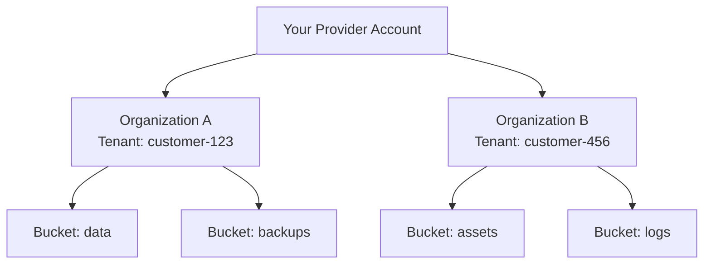

# Multi-Tenant Architecture

When building a multi-tenant SaaS application with Tigris, understanding how to
structure your tenants is crucial for maintaining data isolation, tracking
usage, and scaling efficiently. This guide explains how to map your customers to
Tigris Organizations and architect your integration.

## Understanding the Hierarchy

As a Tigris Partner, you receive a **Provider** account that acts as a container
for all your customer organizations. Here's how the structure looks:



| Component        | Description                                                                                                                                                         |
| ---------------- | ------------------------------------------------------------------------------------------------------------------------------------------------------------------- |
| **Provider**     | Your partner account. This identifies your platform and holds your signing key for API authentication. You manage all customer organizations through this provider. |
| **Organization** | An isolated container for a single tenant/customer. Each organization contains its own buckets, users, access keys, and has separate usage tracking and billing.    |
| **Bucket**       | S3-compatible storage container within an organization. Organizations can have multiple buckets.                                                                    |
| **User**         | An identity within an organization with either `Admin` or `Member` role. Users can create access keys and manage resources within their organization.               |
| **Access Key**   | S3-compatible credentials (access key ID + secret) scoped to an organization. Can optionally be restricted to specific buckets within that org.                     |

## Organizations Explained

### What is an Organization?

An **Organization** in Tigris is the fundamental unit of tenant isolation. Think
of it as a security and billing boundary that completely separates one
customer's resources from another's.

Each organization is:

- **Isolated** - Organizations cannot access each other's buckets, objects, or
  metadata
- **Self-contained** - Has its own users, access keys, buckets, and
  configuration
- **Independently tracked** - Usage and billing are calculated per organization
- **Separately managed** - Can be activated, deactivated, or quota-limited
  without affecting other organizations

## Recommended Tenancy Model

For most SaaS applications, we recommend **one Tigris organization per tenant**.
This 1:1 mapping ensures the strongest isolation boundaries and simplest
operational model.

### Provisioning Flow

When a user signs up in your system:

**1. Create their organization and initial bucket** in a single API call:

```http
POST /v1/providers/{provider_id}/orgs/{org_id}/provision
Content-Type: application/json

{
  "bucket_name": "user-data",
  "org_name": "Acme Corp",
  "user_id": "user-123"
}
```

The `org_id` should be a unique identifier for that tenant in your system (e.g.,
`tenant-abc123` or `customer-{uuid}`).

**2. Store the returned credentials** - The response includes an access key and
secret scoped to that organization:

```json
{
  "access_key_id": "tid_...",
  "secret_access_key": "tsec_...",
  "bucket": "user-data",
  "org_id": "tenant-abc123"
}
```

**3. Create additional buckets** as needed using the Partner API or standard S3
CreateBucket API. All buckets remain isolated within the tenant's organization.

**4. Track usage and billing** - Query the organization-scoped billing and usage
APIs to implement your own billing logic or cost allocation:

```http
GET /v1/providers/{provider_id}/orgs/{org_id}/usage?starting_on=2024-01-01T00:00:00Z&ending_before=2024-02-01T00:00:00Z
```

## Managing the Tenant Lifecycle

### Onboarding New Tenants

Use the provision endpoint to create an organization and initial bucket
atomically. This is idempotent, so retrying with the same parameters won't
create duplicates:

```http
POST /v1/providers/{provider_id}/orgs/{org_id}/provision
Content-Type: application/json

{
  "bucket_name": "main-storage",
  "org_name": "Customer Name",
  "user_id": "admin-user-id",
  "user_role": "Admin",
  "bucket_options": {
    "public": false,
    "storage_class": "STANDARD",
    "regions": "iad,fra"
  },
  "org_quota": {
    "limit_bytes": 107374182400
  }
}
```

### Offboarding Tenants

To offboard a tenant, deactivate their organization. This immediately revokes
access for all users and access keys:

```http
PUT /v1/providers/{provider_id}/orgs/{org_id}
Content-Type: application/json

{
  "user_id": "admin-user",
  "active": false
}
```

**What happens when you deactivate:**

- All access keys are immediately invalidated
- No new resources can be provisioned
- Existing buckets and data remain intact for recovery or compliance
- Usage tracking continues for final billing calculations

**To permanently delete data:**

1. Deactivate the organization
2. Generate a final invoice for the period
3. Delete all buckets using the bucket deletion API
4. The organization remains for historical billing records

## Next Steps

Now that you understand how to structure your multi-tenant architecture, explore
**[Partner Integrations API Reference](/docs/partner-integrations/api/)** for
the complete API documentation.

### Getting Help

Have questions about your integration? We're here to help:

- **Email:** [help@tigrisdata.com](mailto:help@tigrisdata.com)
