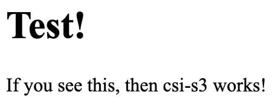

# Kubernetes Quickstart

Tigris is S3-compatible, so any Kubernetes workload that uses S3 works with
Tigris. There are two ways to connect:

| Approach                                                  | Use when                                       | How it works                                      |
| --------------------------------------------------------- | ---------------------------------------------- | ------------------------------------------------- |
| [**Environment variables**](#environment-variables)       | Your app uses an S3 SDK (boto3, AWS SDK, etc.) | Store credentials in a Secret, inject as env vars |
| [**Filesystem mount (CSI-S3)**](#filesystem-mount-csi-s3) | Your app reads/writes files from disk          | Mount a Tigris bucket as a PersistentVolume       |

## Environment variables

Store your Tigris credentials in a Kubernetes Secret and inject them into your
Deployment as environment variables. This is the most common approach.

### Create a bucket and access key

1. Create a Tigris bucket at [storage.new](https://storage.new).
2. Create an access key in the [dashboard](https://console.tigris.dev). Give it
   editor permissions on your bucket and copy the credentials.

### Create a Secret

```yaml
# secret-tigris-key-mybucket.yaml
apiVersion: v1
kind: Secret
metadata:
  name: tigris-key-mybucket
type: Opaque
stringData:
  AWS_ACCESS_KEY_ID: tid_*
  AWS_SECRET_ACCESS_KEY: tsec_*
  AWS_ENDPOINT_URL_S3: https://t3.storage.dev
  AWS_ENDPOINT_URL_IAM: https://iam.storage.dev
  AWS_REGION: auto
  BUCKET_NAME: mybucket
```

```text
kubectl apply -f secret-tigris-key-mybucket.yaml
```

### Attach the Secret to your Deployment

Reference the Secret in your container spec using `envFrom`:

```yaml
# deployment-myapp.yaml
# inside the spec field of a apps/v1 Deployment
containers:
  - name: web
    image: myuser/myimage
    envFrom:
      - secretRef:
          name: tigris-key-mybucket
```

```text
kubectl apply -f deployment-myapp.yaml
```

Your application can now use any S3 SDK to read and write objects in Tigris.

## Filesystem mount (CSI-S3)

Use [csi-s3](https://github.com/yandex-cloud/k8s-csi-s3) to mount a Tigris
bucket as a PersistentVolume. This is useful for workloads that expect a
filesystem rather than an S3 API. The driver supports ReadWriteMany access, so
multiple Pods across multiple Nodes can use the same bucket.

:::tip

For workloads that need more control over caching and performance tuning (such
as AI/ML training), consider [TigrisFS](/docs/training/tigrisfs) instead.
TigrisFS is a Tigris-optimized FUSE filesystem with configurable memory limits,
flusher threads, and metadata cache TTLs. It requires manual setup per node
rather than a CSI driver, but gives you fine-grained control over I/O behavior.

:::

### Install csi-s3

If you don't already have Helm installed:

```text
brew install helm
```

Create an access key in the [Tigris dashboard](https://console.tigris.dev), then
install the csi-s3 Helm chart:

```text
helm repo add yandex-s3 https://yandex-cloud.github.io/k8s-csi-s3/charts

helm install csi-s3 yandex-s3/csi-s3 \
  --set secret.accessKey=tid_... \
  --set secret.secretKey=tsec_... \
  --set secret.endpoint=https://t3.storage.dev \
  --set secret.region=auto \
  --set storageClass.name=tigris \
  --namespace=kube-system
```

### Use a dynamically created bucket

Create a PersistentVolumeClaim with the `tigris` StorageClass. Kubernetes will
automatically create a new Tigris bucket:

```yaml
apiVersion: v1
kind: PersistentVolumeClaim
metadata:
  name: infinite-storage
  namespace: default
spec:
  accessModes:
    - ReadWriteMany
    - ReadWriteOnce
  resources:
    requests:
      storage: 5Gi
  storageClassName: tigris
```

Mount it in a Pod or Deployment:

```yaml
apiVersion: v1
kind: Pod
metadata:
  name: tigris-test-nginx
  namespace: default
spec:
  containers:
    - name: www
      image: nginx
      volumeMounts:
        - mountPath: /usr/share/nginx/html
          name: webroot
  volumes:
    - name: webroot
      persistentVolumeClaim:
        claimName: infinite-storage
        readOnly: false
```

The bucket name will match the PersistentVolume name assigned by Kubernetes
(e.g. `pvc-836006cd-f687-4819-92b9-6ff0fb908d61`).

### Test the mount

To verify the volume is working, upload a test file and serve it with nginx.
Create an `index.html`:

```html
<title>Test!</title>
<h1>Test!</h1>
<p>If you see this, then csi-s3 works!</p>
```

Port-forward the pod:

```text
kubectl port-forward pod/tigris-test-nginx 8080:80
```

Open http://localhost:8080 in your browser. You should see the test page:



### Use an existing bucket

To mount a bucket that already exists, create both a PersistentVolume and a
PersistentVolumeClaim. These must be created at the same time so Kubernetes
establishes the bidirectional link between them.

```yaml
apiVersion: v1
kind: PersistentVolume
metadata:
  name: mybucket
spec:
  storageClassName: tigris
  capacity:
    storage: 10Ti
  accessModes:
    - ReadWriteMany
  claimRef:
    namespace: default
    name: mybucket
  csi:
    driver: ru.yandex.s3.csi
    controllerPublishSecretRef:
      name: csi-s3-secret
      namespace: csi-s3
    nodePublishSecretRef:
      name: csi-s3-secret
      namespace: csi-s3
    nodeStageSecretRef:
      name: csi-s3-secret
      namespace: csi-s3
    volumeAttributes:
      capacity: 10Ti
      mounter: geesefs
      options: --memory-limit 1000 --dir-mode 0777 --file-mode 0666
    volumeHandle: mybucket
---
apiVersion: v1
kind: PersistentVolumeClaim
metadata:
  name: mybucket
spec:
  storageClassName: "tigris"
  resources:
    requests:
      storage: 10Ti
  volumeMode: Filesystem
  accessModes:
    - ReadWriteMany
  volumeName: mybucket
```

Then mount it in your Pod or Deployment the same way as above, using
`claimName: mybucket`.
