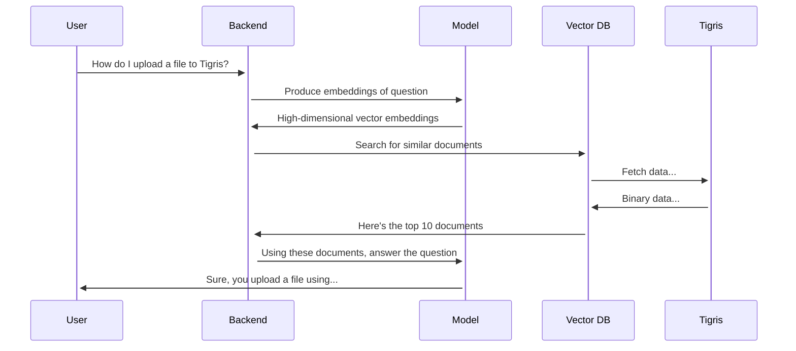

# LanceDB Quickstart

import CodeBlock from "@theme/CodeBlock";
import Tabs from "@theme/Tabs";
import TabItem from "@theme/TabItem";

[LanceDB](https://lancedb.github.io/lancedb/) is an open-source vector database
(like a search engine) that enables you to ingest, and query documents via any
number of backends, including Tigris. When you ingest a document into LanceDB,
you use an
[embedding model](https://www.cloudflare.com/learning/ai/what-are-embeddings/)
to transform the text of the document into high-dimensional embedding vectors.
These vectors can be searched through
[cosine similarity](https://en.wikipedia.org/wiki/Cosine_similarity), allowing
you to search by concepts (eg: "hot" and "warm" would register as adjacent to
eachother) instead of just the pure words of a search query.

The main reason you'd want to bring a vector database into the equation is if
you're doing a
[Retrieval-Augmented Generation (RAG)](https://blogs.nvidia.com/blog/what-is-retrieval-augmented-generation/)
pipeline like this:



Vector databases are also general search engines and you can search anything
that can be embedded, be it text, images, audio, or video. Most AI providers
offer an embedding model and nearly all of them are good enough for just about
any task you would want to do.

## Getting Started

To get started, install LanceDB into your project's NPM dependencies:

<Tabs>
  <TabItem value="npm" label="npm" default>

```text
npm install --save @lancedb/lancedb apache-arrow
```

  </TabItem>
  <TabItem value="pnpm" label="pnpm">

```text
pnpm add @lancedb/lancedb apache-arrow
```

  </TabItem>
  <TabItem value="yarn" label="yarn">

```
yarn add @lancedb/lancedb apache-arrow
```

  </TabItem>
</Tabs>

Then import LanceDB into your project:

```ts
import * as lancedb from "@lancedb/lancedb";
import * as arrow from "apache-arrow";

const bucketName = process.env.BUCKET_NAME || "tigris-example";

const db = await lancedb.connect(`s3://${bucketName}/docs`, {
  storageOptions: {
    endpoint: "https://fly.storage.tigris.dev",
    region: "auto",
  },
});
```

Then register the embedding model you plan to use, such as
[OpenAI's embedding model](https://platform.openai.com/docs/guides/embeddings):

```ts
import "@lancedb/lancedb/embedding/openai";
import { LanceSchema, getRegistry, register } from "@lancedb/lancedb/embedding";
import { EmbeddingFunction } from "@lancedb/lancedb/embedding";

const func = getRegistry()
  .get("openai")
  ?.create({ model: "text-embedding-3-small" }) as EmbeddingFunction;
```

And create the schema for the data you want to ingest:

```ts
const contentSchema = LanceSchema({
  text: func.sourceField(new arrow.Utf8()),
  vector: func.vectorField(),
  //title: new arrow.Utf8(),
  url: new arrow.Utf8(),
  heading: new arrow.Utf8(),
});
```

This creates a schema that has a few fields:

- The source `text` that you are searching against
- The high-dimensional generated `vector` used to search for similar embeddings
- Additional metadata such as the `title`, `heading`, and `url` of the document
  you're embedding so that the model can link users back to a source

Strictly speaking, only the `text` and `vector` fields are required. The rest
are optional but can help you make the user experience better. Users tend to
trust responses that have citations a lot more than responses that don't.

Next, create a table that uses that schema:

```ts
const tbl = await db.createEmptyTable("content", contentSchema, {
  // if both of these are set, LanceDB uses the semantics of
  // `CREATE TABLE IF NOT EXISTS content` in your favorite relational
  // database.
  mode: "create",
  existOk: true,
});
```

### Ingesting files

The exact details of how you ingest files will vary based on what you are
ingesting, but at a high level you can make a lot of cheap assumptions about the
data that will help. The biggest barrier to ingesting data into a model is a
combination of two factors:

1. The context window of the model
   ([8191 tokens for OpenAI models](https://dev.to/simplr_sh/the-best-way-to-chunk-text-data-for-generating-embeddings-with-openai-models-56c9)).
2. Figuring out where to chunk files such that they fit into the context window
   of the model.

For the sake of argument, let's say that we're dealing with a folder full of
[Markdown documents](https://en.wikipedia.org/wiki/Markdown). Markdown is a
fairly variable format that is versatile enough (this document is written in a
variant of Markdown), but we can also take advantage of human organizational
psychology to make this easier. People generally break Markdown documents into
sections where each section is separated by a line beginning with one or more
hashes:

```markdown
# Title of the document

Ah yes, the venerable introduction paragraph—the sacred scroll...

## Insights

What began as an unrelated string of metaphors...
```

You can break this into two chunks:

```json
[
  {
    "heading": "Title of the document",
    "content": "Ah yes, the venerable introduction paragraph—the sacred scroll..."
  },
  {
    "heading": "Insights",
    "content": "What began as an unrelated string of metaphors..."
  }
]
```

Each of these should be indexed separately and the heading metadata should be
attached to each record in the database. You can break it up into sections of up
to 8191 tokens (or however big your model's context window is) with logic like
this:

import markdownChunk from "!!raw-loader!./markdownChunk.ts";

<details>
  <summary>Long code block with example document chunking code</summary>
  <CodeBlock language="ts">{markdownChunk}</CodeBlock>
</details>

Then when you're reading your files, use a loop like this to break all of the
files into chunks:

```ts
import { glob } from "glob";
import { readFile } from "node:fs/promises";
import { chunkify } from "./markdownChunk";

const markdownFiles = await glob("./docs/**/*.md");

const files = [...markdownFiles].filter(
  (fname) => !fname.endsWith("README.md")
);
files.sort();

const fnameToURL = (fname) => {
  // Implement me!
};

const utterances = [];

for (const fname of files) {
  const data = await readFile(fname, "utf-8");
  const chunks = await chunkify(data);

  chunks.forEach(({ heading, content }) => {
    utterances.push({
      fname,
      heading,
      content,
      url: fnameToURL(fname),
    });
  });
}
```

And finally ingest all the files into LanceDB:

```ts
let docs: unknown = []; // temporary buffer so we don't block all the time
const MAX_BUFFER_SIZE = 100;
for (const utterance of utterances) {
  const { heading, content, url } = utterance;
  docs.push({
    heading,
    content,
    url,
  });

  if (docs.length >= MAX_BUFFER_SIZE) {
    console.log(`adding ${docs.length} documents`);
    await tbl.add(docs);
    docs = [];
  }
}

if (docs.length !== 0) {
  console.log(`adding ${docs.length} documents`);
  await tbl.add(docs);
}
```

Finally, create an index on the `vector` field so the LanceDB client can search
faster:

```ts
await tbl.createIndex("vector");
```

And then run an example search for the term "Tigris":

```ts
const query = "Tigris";
const actual = await tbl.search(query).limit(10).toArray();
console.log(
  actual.map(({ url, heading, text }) => {
    return { url, heading, text };
  })
);
```

import entireExample from "!!raw-loader!./testlancedb.ts";

<details>
  <summary>The entire example in one big file</summary>
  <CodeBlock language="ts">{entireExample}</CodeBlock>
</details>

## Example: Docs search

We've created an example app that lets you search the Tigris docs using LanceDB
and the OpenAI embedding model at
[tigrisdata-community/docs-search-example](https://github.com/tigrisdata-community/docs-search-example).
To set this up you need the following:

- An API key for OpenAI
- A [Tigris account and bucket](https://storage.new)
- A Tigris [access keypair](https://console.tigris.dev/createaccesskey)
- [Node.js](https://nodejs.org/en) installed

Clone the repository to your local machine:

```text
git clone https://github.com/tigrisdata-community/docs-search-example
cd docs-search-example
```

Install all of the NPM dependencies:

```text
npm ci
```

Then clone the blog and documentation repositories:

```text
cd var
git clone https://github.com/tigrisdata/tigris-blog
git clone https://github.com/tigrisdata/tigris-os-docs
cd ..
```

Set your OpenAI API key and Tigris credentials in your environment:

```text
export OPENAI_API_KEY=sk-hunter2-hunter2hunter2hunter2
export AWS_ACCESS_KEY_ID=tid_AzureDiamond
export AWS_SECRET_ACCESS_KEY=tid_hunter2hunter2hunter2
export AWS_ENDPOINT_URL_S3=https://fly.storage.tigris.dev
export AWS_REGION=auto
export BUCKET_NAME=your-bucket-name-here
```

Make sure to replace the secrets with your keys!

Ingest the docs with `ingest.ts`:

```text
npx tsx ingest.ts
```

Then you can run the server with `node`:

```text
node index.js
```

Then open [http://localhost:3000](http://localhost:3000) and search for whatever
you want to know!

## Next steps

The following is left as an exercise for the reader:

- The markdown chunkify function doesn't properly handle Markdown
  [front matter](https://frontmatter.codes/docs/markdown). Try adding support
  for it using the
  [gray-matter package](https://www.npmjs.com/package/gray-matter).
- Try integrating this with an AI model by passing the user query through
  LanceDB to get a list of candidate documents, insert the document details, and
  then see how it changes the results of your model.

What else can you do with this database? The cloud's the limit!
