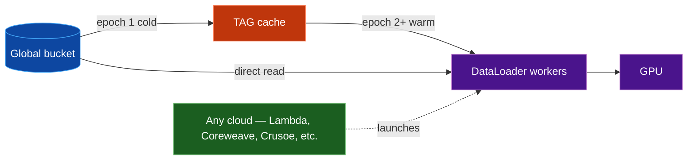
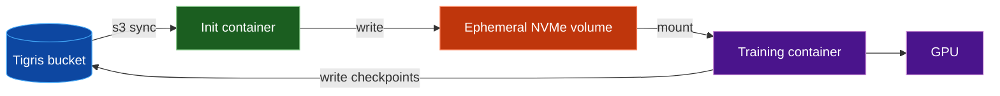
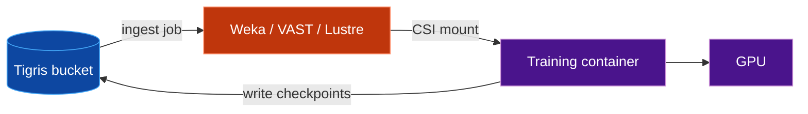
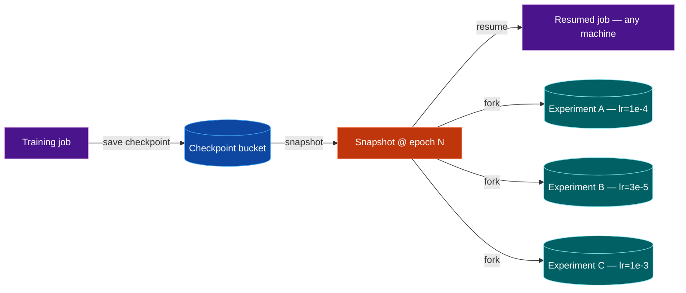
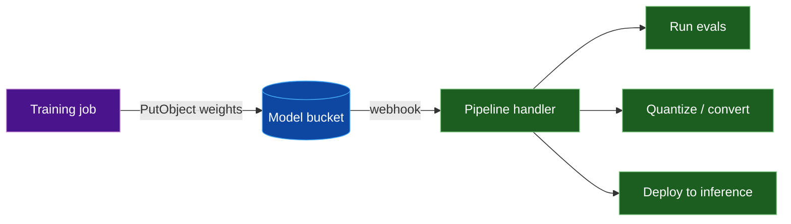
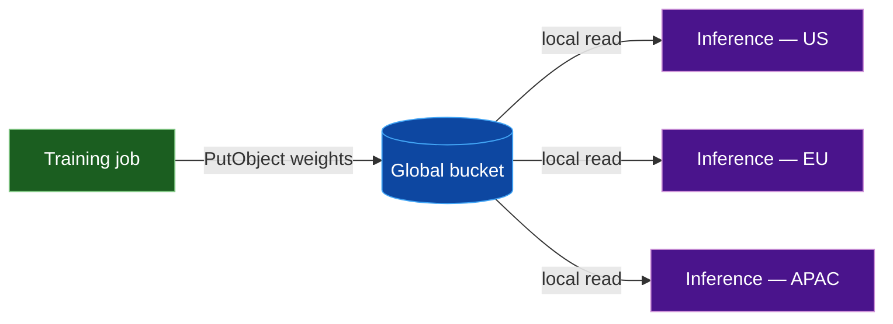

import {
  HomepageCard as Card,
  HomepageSection as Section,
} from "@site/src/components/HomepageComponents.jsx";

# Tigris Storage for Model Training

Training runs are long, expensive, and data-hungry. The storage layer has to
stream terabytes to GPUs without becoming a bottleneck, persist checkpoints that
let you resume on a different machine or cloud, and deliver finished weights to
inference endpoints worldwide — all without surprise egress bills.

This page covers five patterns where Tigris's architecture fits the access
patterns of model training better than conventional S3.

## Five Core Use Cases

<Section>
  <Card
    title="Stream training data to GPUs"
    description="Feed datasets directly into PyTorch DataLoaders from a global bucket, with local caching for repeat epochs."
    to="#stream-training-data-to-gpus"
    icon="img/atom"
  />
  <Card
    title="Hydrate datasets to local storage"
    description="Sync datasets from Tigris to local NVMe or a parallel filesystem before training, keeping Tigris as the durable source of truth."
    to="#hydrate-datasets-to-local-storage"
    icon="img/lightning"
  />
  <Card
    title="Checkpoint, resume, and fork training runs"
    description="Snapshot model state mid-training, resume anywhere, and fork for parallel experiments."
    to="#checkpoint-resume-and-fork-training-runs"
    icon="img/spark"
  />
  <Card
    title="Trigger post-training pipelines on upload"
    description="Fire a webhook when a checkpoint or final model lands to kick off eval, conversion, or deployment."
    to="#trigger-post-training-pipelines-on-upload"
    icon="img/globe"
  />
  <Card
    title="Store and serve model weights globally"
    description="Write fine-tuned weights once and load them for inference from the nearest region at zero egress cost."
    to="#store-and-serve-model-weights-globally"
    icon="img/bolt"
  />
</Section>

## 1. Stream training data to GPUs {#stream-training-data-to-gpus}

Training jobs need data fed to the GPU fast enough that compute never stalls
waiting on storage. With Tigris you can stream objects straight into PyTorch
DataLoaders without staging anything locally, and the same bucket works from any
cloud or region.

The
[S3 Connector for PyTorch](https://github.com/awslabs/s3-connector-for-pytorch)
reads objects directly from Tigris into your training loop. `S3IterableDataset`
streams sequentially for large-scale runs; `S3MapDataset` gives random access
when you need shuffling or indexed lookups. Each DataLoader worker automatically
gets a distinct partition of the iterable dataset.

<div className="mermaid-frame">

</div>
<div className="mermaid-caption">
  Figure 1: Training data streams from a global bucket through optional TAG
  caching into DataLoader workers, which can run on any cloud.
</div>

In [benchmarks](/docs/overview/benchmarks/model-training) replicating
[AWS's own S3-training workload](https://aws.amazon.com/blogs/storage/optimizing-model-training-accessing-s3-data-with-pytorch/),
Tigris matches AWS S3 throughput on the same setup. Adding
[TAG (Tigris Acceleration Gateway)](/docs/overview/benchmarks/model-training#3-tag-eliminates-network-latency-after-epoch-1),
a local S3-compatible caching proxy that runs on the training instance,
eliminates network round-trips after epoch 1: warm epochs run **5.7x faster**,
the workers needed to saturate the GPU drop from **16 to 4**, and the local
NVMe cache provides **~200x** throughput headroom over what the GPU can
consume.

For multi-cloud training, GPU instances can run on any provider — Lambda,
CoreWeave, Crusoe, or a hyperscaler. Because all nodes read from the same
global Tigris bucket at the nearest replica, there are no cross-cloud egress
costs and no per-region storage to manage.

For more information, see the docs:
[PyTorch quickstart](/docs/quickstarts/pytorch) ·
[Training benchmarks](/docs/overview/benchmarks/model-training) ·
[Bucket locations](/docs/buckets/locations/)

:::tip

Use `pin_memory=True` and `persistent_workers=True` on your DataLoader for
faster host-to-GPU transfers and lower worker startup overhead between epochs.

:::

## 2. Hydrate datasets to local storage {#hydrate-datasets-to-local-storage}

Streaming directly from object storage works for fine-tuning and lighter
workloads, but large-scale pre-training with heavy random I/O needs the dataset
on fast local storage before training starts. Tigris acts as the durable,
globally accessible source of truth: you hydrate data out of it into local NVMe
or a parallel filesystem for the duration of a job, then write results back.
This keeps you from paying for expensive filesystem storage around the clock
while still getting full disk-speed reads during training.

Two patterns are common in production.

### Kubernetes init container

An init container copies the dataset from Tigris into ephemeral node-local
storage before the training container starts. The volume is then mounted into
the training pod.

<div className="mermaid-frame">


</div>
<div className="mermaid-caption">
  Figure 2a: An init container hydrates an ephemeral volume from Tigris before
  the training container starts.
</div>

```yaml
initContainers:
  - name: hydrate-dataset
    image: amazon/aws-cli
    command:
      - sh
      - -c
      - aws s3 sync s3://my-dataset /data/dataset --endpoint-url
        https://t3.storage.dev
    volumeMounts:
      - name: dataset
        mountPath: /data/dataset
    env:
      - name: AWS_ACCESS_KEY_ID
        valueFrom:
          secretKeyRef: { name: tigris-creds, key: access-key-id }
      - name: AWS_SECRET_ACCESS_KEY
        valueFrom:
          secretKeyRef: { name: tigris-creds, key: secret-access-key }
containers:
  - name: train
    image: my-training-image
    command:
      [
        "torchrun",
        "--nproc_per_node=8",
        "train.py",
        "--data-dir",
        "/data/dataset",
      ]
    volumeMounts:
      - name: dataset
        mountPath: /data/dataset
volumes:
  - name: dataset
    emptyDir: {} # backed by root disk; use a hostPath or local PV for NVMe
```

:::caution

`emptyDir` volumes share the node's root disk by default and are subject to its
available space. If your dataset is larger than the free space on that
mountpoint, the sync will fail. For large datasets, use a `hostPath` mount
pointing at a dedicated NVMe drive or provision a `local` PersistentVolume with
a known capacity.

:::

Because Tigris serves reads from the nearest region, the sync saturates the
available link regardless of where the job is scheduled. For datasets that don't
change between runs, the sync is incremental — only new or modified objects
transfer.

NVIDIA's
[GPUDirect Storage](https://docs.nvidia.com/gpudirect-storage/overview-guide/)
can further reduce overhead by enabling direct NVMe-to-GPU data paths, bypassing
the CPU during data loading.

### Parallel filesystem (Weka, VAST, Lustre)

A separate ingestion job copies data from Tigris into a high-performance
parallel filesystem. The training container then mounts the filesystem through
its CSI driver and reads at full filesystem speed.

<div className="mermaid-frame">

</div>
<div className="mermaid-caption">
  Figure 2b: A separate job ingests data from Tigris into a parallel filesystem.
  The training container mounts the filesystem via CSI.
</div>

Object storage stays the persistent store. The parallel filesystem is
provisioned only for the duration of training, so you avoid paying for
high-performance storage around the clock. Weka, VAST, and other vendors
provide S3 data-import features and Kubernetes CSI plugins that make the
hydrate-mount-train cycle straightforward.

```bash
# Hydrate Weka from Tigris (run as a separate k8s job or CLI step)
aws s3 sync s3://my-dataset /mnt/weka/dataset --endpoint-url https://t3.storage.dev

# Training container sees /mnt/weka/dataset via CSI mount
torchrun --nproc_per_node=8 train.py --data-dir /mnt/weka/dataset

# Write results back to Tigris
aws s3 cp /mnt/weka/checkpoints/ s3://my-checkpoints/ --recursive --endpoint-url https://t3.storage.dev
```

For more information, see the docs: [TigrisFS](/docs/training/tigrisfs/) ·
[Bucket locations](/docs/buckets/locations/) ·
[rclone quickstart](/docs/quickstarts/rclone/)

:::tip

For datasets that change infrequently, run `aws s3 sync` with `--size-only` to
skip unchanged files based on size rather than checksumming every object. This
cuts hydration time on repeat runs.

:::

## 3. Checkpoint, resume, and fork training runs {#checkpoint-resume-and-fork-training-runs}

Long training jobs fail. Spot instances get preempted, nodes crash, and
hyperparameters need revising. If you're not checkpointing to durable storage,
you restart from scratch.

Writing checkpoints to a Tigris bucket with
[snapshots enabled](/docs/buckets/snapshots-and-forks/) gives you two things at
once. **Resume**: when a job dies or you migrate to cheaper hardware, the
orchestrator restarts on a new machine and loads the latest checkpoint from the
nearest replica — no cross-region prefetch, no egress cost. **Fork**: when you
want to branch from a known-good checkpoint to run parallel experiments, each
fork gets its own copy-on-write view of the bucket instantly. Mutations in one
fork never affect another, and the source checkpoint stays immutable.

<div className="mermaid-frame">


</div>
<div className="mermaid-caption">
  Figure 3: A training job checkpoints into a snapshot, then either resumes from
  it or forks into parallel experiments with different hyperparameters.
</div>

In practice, you create the bucket with `X-Tigris-Enable-Snapshot: true` at
creation time (`X-Tigris-Enable-Snapshot` must be set at creation and cannot be
changed afterward), then have your training loop write checkpoints on a fixed
cadence (every N steps or at epoch boundaries). Store the snapshot version ID
alongside the run metadata in your experiment tracker. To resume, pass the
version to the new job. To sweep hyperparameters, fork the snapshot once per
configuration and let each fork write independently.

For more information, see the docs:
[Bucket snapshots and forks](/docs/buckets/snapshots-and-forks/) ·
[Model storage](/docs/model-storage/) · [TigrisFS](/docs/training/tigrisfs/)

:::tip

Scope each training job's credentials with a
[fine-grained IAM policy](/docs/iam/policies/examples/training-job): read-only
to the dataset bucket, read-only to the base model, write-only to the output
bucket, with optional time-window and IP restrictions.

:::

## 4. Trigger post-training pipelines on upload {#trigger-post-training-pipelines-on-upload}

After a training job writes a checkpoint or a final set of weights, downstream
work usually follows: evaluation, quantization, conversion to a serving format,
or deployment to an inference fleet. Polling the bucket for new objects adds
latency, wastes API calls, and complicates orchestration.

[Tigris Object Notifications](/docs/buckets/object-notifications/) replace the
polling loop with a push model. An HTTP `POST` fires to your webhook the moment
a new object lands, carrying the bucket, key, size, and ETag. Your pipeline
handler can start immediately — run evals against the new checkpoint, kick off
ONNX or TensorRT conversion, or trigger a rolling deploy to your inference
fleet.

<div className="mermaid-frame">


</div>
<div className="mermaid-caption">
  Figure 4: A training job uploads weights, triggering a webhook that fans out
  to evaluation, conversion, and deployment.
</div>

You configure a notification rule through Tigris Dashboard, pointing it at
an HTTPS endpoint you control. Filter to exactly the events you care about — for
example, only objects under the `checkpoints/` or `final/` prefix — so your
handler isn't invoked on intermediate artifacts it doesn't need.

For more information, see the docs:
[Object notifications](/docs/buckets/object-notifications/)

:::tip

Filter webhooks to the keys that matter:

```sql
WHERE `key` REGEXP "^final/" AND `Event-Type` = "OBJECT_CREATED_PUT"
```

:::

:::note

Notifications are delivered at least once and can arrive out of order across
regions. Use the `Last-Modified` timestamp on the object (not `eventTime`) to
sequence events correctly, and design your handler to be idempotent.

:::

## 5. Store and serve model weights globally {#store-and-serve-model-weights-globally}

Once training is done, the weights need to reach inference endpoints that may be
spread across regions and clouds. Copying files to per-region buckets is slow to
set up, expensive to maintain, and drifts when you forget to sync after a
retrain.

A single `PutObject` to a [global Tigris bucket](/docs/buckets/locations/) makes
the weights available worldwide. Inference nodes read from the nearest replica
at no egress cost. Because weights are immutable per version, conditional
`GetObject` calls with `If-None-Match` let nodes skip the download entirely if
they already have the current version — useful for rolling deploys where most
nodes are already warm.

<div className="mermaid-frame">

</div>
<div className="mermaid-caption">
  Figure 5: Training uploads weights once and inference nodes load them from the
  nearest replica.
</div>

In practice, your training job writes the final weights (or LoRA adapters) to a
versioned key such as `models/{model}/{run_id}/weights.safetensors`. Inference
nodes learn the key from your model registry or control plane and pull on
startup or rollout. For frameworks that expect local file paths, mount the bucket
with [TigrisFS](/docs/training/tigrisfs/) and load directly from the mount
point — `torch.load("/mnt/tigris/model.bin")` or
`AutoModel.from_pretrained("/mnt/tigris/my-model/")` work without code changes.

For more information, see the docs:
[Model storage](/docs/model-storage/) ·
[Presigned URLs](/docs/objects/presigned/) ·
[TigrisFS](/docs/training/tigrisfs/) ·
[Bucket locations](/docs/buckets/locations/)

## Next steps

| Topic                                                              | What you'll find there                                                                       |
| ------------------------------------------------------------------ | -------------------------------------------------------------------------------------------- |
| [Get started with Tigris](/docs/get-started/)                      | A guided walkthrough for creating buckets, uploading objects, and running basic workloads.    |
| [PyTorch quickstart](/docs/quickstarts/pytorch)                    | End-to-end setup for streaming training data from Tigris into PyTorch DataLoaders.            |
| [Training benchmarks](/docs/overview/benchmarks/model-training)    | ViT benchmark results, sharding strategies, and TAG caching performance numbers.              |
| [Training with big data](/docs/training/big-data-skypilot/)        | Multi-cloud LoRA fine-tuning walkthrough with SkyPilot and Tigris.                            |
| [Snapshots and forks](/docs/buckets/snapshots-and-forks/)          | Concepts and API flows for creating snapshots, forking buckets, and managing versions.        |
| [Model storage](/docs/model-storage/)                              | Patterns for storing, versioning, and serving model weights with boto3, s3fs, and TigrisFS.   |
