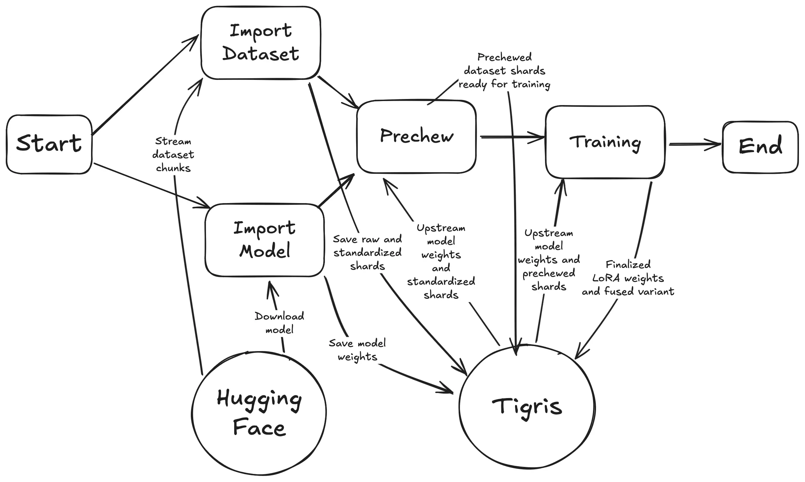

# Training with Big Data on SkyPilot

[SkyPilot](https://skypilot.readthedocs.io/en/latest/docs/index.html) simplifies
multi-cloud deployments, offering flexibility for training large-scale data
models across different cloud providers. Unlike custom solutions or more
involved tools like Terraform, SkyPilot provides an effortless way to deploy
workloads seamlessly across clouds, eliminating the need for manual
intervention.

While multi-cloud tools like SkyPilot abstract away cloud provider specific
quirks, underlying egress costs and bottlenecks in the storage layer can be
roadblocks. Combining Tigris with SkyPilot ensures there are no cross-cloud
egress costs, all while ensuring consistent performance and reliability in any
region.

In this guide, you'll build a multi-cloud compatible model training job that
leverages Tigris to store training data and SkyPilot to manage compute.

## Prerequisites

- A Tigris account
- [SkyPilot](https://skypilot.readthedocs.io/en/latest/getting-started/installation.html)
  installed
- A bucket you want to use for training and model data (`mybucket`)
- Our
  [demo training repository](https://github.com/tigrisdata-community/skypilot-training-demo)
  cloned
- Accounts with your desired cloud providers (AWS, Lambda Labs, RunPod,
  Fluidstack, etc; we'll use AWS in this guide)

## Setting up your enviroment variables

Copy `.env.example` to `.env` in the root of the training repository.

```text
cp .env.example .env
```

Fill in the following variables:

| Variable                | Description                                                                        | Example                  |
| ----------------------- | ---------------------------------------------------------------------------------- | ------------------------ |
| `AWS_ACCESS_KEY_ID`     | Your Tigris access key                                                             | `tid_*`                  |
| `AWS_SECRET_ACCESS_KEY` | Your Tigris secret key                                                             | `tsec_*`                 |
| `BUCKET_NAME`           | The name of the bucket you want to use for storing model weights and training data | `mybucket`               |
| `DATASET_NAME`          | The name of the dataset you want to use for training                               | `mlabonne/FineTome-100k` |
| `MODEL_NAME`            | The name of the model you want to train                                            | `Qwen/Qwen2.5-0.5B`      |

## Performing training

Kick off training with the following command:

```text
sky launch -n test allatonce.yaml --env-file .env --workdir . -i 15 --down
```

## What's happening under the hood?

While that runs, here's what's going on. SkyPilot is spinning up a new GPU
instance somewhere in the cloud, installing the necessary software and
dependencies, and training a [LoRA](https://github.com/microsoft/LoRA) (Low-Rank
Adaptation) adapter on the model you chose in your `.env` file. Once training is
complete, the instance automatically shuts down after 15 minutes of inactivity.

It does this by running a series of scripts in sequence:

1. `import-dataset.py`: Downloads the dataset from Hugging Face and copies it to
   Tigris in shards of up to 5 million examples. Each shard is saved to Tigris
   unmodified, then standardized so that the model can understand it.
2. `import-model.py`: Downloads the model weights from Hugging Face and copies
   them to Tigris for permanent storage.
3. `pretokenize.py`: Loads each shard of the dataset from Tigris and uses the
   model's tokenization formatting to pre-chew it for training.
4. `dotrain.py`: Trains the model on each shard of the dataset for one epoch and
   saves the resulting weights to Tigris.

Here's a diagram of the process:



This looks a lot more complicated than it is. Each script is designed to be run
in sequence and everything adds up to a training run that takes about 15 minutes
to complete from start to finish. A side effect of how the scripts are made is
that you can repeat them in a loop over and over and they will only mutate the
bucket when it is needed. This is useful for debugging and for running the
training pipeline in parallel with other datasets or models.

Here's some of the most relevant code from each script. You can find the full
scripts in the
[example repo](https://github.com/tigrisdata-community/skypilot-training-demo).

### Importing and sharding the dataset

One of the biggest things that's hard with managing training data with AI stuff
is dealing with data that is larger than ram. Most of the time when you load a
dataset with the
[`load_dataset` function](https://huggingface.co/docs/datasets/loading), it
downloads all of the data files to the disk and then loads them directly into
memory. This is generally useful for many things, but it means that your dataset
has to be smaller than your memory capacity (minus what your OS needs to exist).

This example works around this problem by using the `streaming=True` option in
`load_dataset`:

```python
dataset = load_dataset(dataset_name, split="train", streaming=True)
```

Passing `streaming=True` to `load_dataset` results in you getting an
`IterableDataset` instead of a normal `Dataset` object back, which means that
you can't use the `.save_to_disk` method to save the dataset to disk. Instead,
you have to iterate over the dataset in chunks and save each
[shard](<https://en.wikipedia.org/wiki/Shard_(database_architecture)>) to disk
manually:

```python
for shard_id, shard in enumerate(dataset.iter(5_000_000)):
    dataset = Dataset.from_dict(shard, features=dataset.features)
    ds.save_to_disk(f"s3://{bucket_name}/raw/{dataset_name}/{shard_id}", storage_options=storage_options)
```

The shard size of 5,000,000 was chosen by the author of this example because
it's a nice round number. Depending on the facts and circumstances of your
datasets, you may need to reduce this number to fit the dataset into memory.

Once the raw dataset is downloaded, it is standardized. Datasets come in any
number of formats, and this exact example assumes that the dataset is in the
[ShareGPT](https://docs.unsloth.ai/basics/chat-templates) format. You may have
to write your own standardization function depending on the format of the
dataset you want to train on. Either way, this is where you would do it:

```python
ds = standardize_dataset(ds)
```

After that, you can save the standardized dataset to Tigris:

```python
ds.save_to_disk(f"s3://{bucket_name}/standardized/{dataset_name}/{shard_id}", storage_options=storage_options)
```

There's some additional accounting that's done to keep track of the biggest
shard ID (the shard ID accounting JSON file is also used as a sentinel for the
dataset being imported). A dataset that is potentially too big to fit into
memory is broken into shards that are able to fit into memory, standardized, and
then saved to Tigris.

:::note

In very large scale deployments, you may want to move the standardization step
into another discrete stage of this pipeline. Refactoring this into the setup is
therefore trivial and thus left as an exercise for the reader.

:::

### Importing the model

Once all of the data is imported, the model weights are fetched from Hugging
Face's CDN and then written to Tigris:

```python
model, tokenizer = FastLanguageModel.from_pretrained(
    model_name = model_name, # Qwen/Qwen2.5-0.5B
    max_seq_length = 4096,
    dtype = None, # auto detection
    load_in_4bit = False, # If True, use 4bit quantization to reduce memory usage
)

# Save the model to Tigris
model.save_pretrained(f"{home_dir}/tigris/models/{model_name}")
tokenizer.save_pretrained(f"{home_dir}/tigris/models/{model_name}")
```

Note that the model weights are saved to Tigris using the `{home_dir}/tigris`
folder. Tigris isn't normally a Linux filesystem, but this example uses
[geesefs](https://github.com/yandex-cloud/geesefs) to
[mount Tigris](https://www.tigrisdata.com/docs/training/geesefs-linux/) as a
[FUSE](https://www.kernel.org/doc/html/latest/filesystems/fuse.html) (Filesystem
in Userspace) filesystem. This allows you to use normal filesystem calls to
interact with Tigris, which is useful for AI workloads that assume data is
accessible via a filesystem.

The model has two main components that we care about:

- The model weights themselves, these are the weights that get loaded into GPU
  ram and used to inference results based on input data.
- The tokenizer model for that model in particular. This is used to convert text
  into the format that the model understands beneath the hood. Among other
  things, this also provides a string templating function that turns chat
  messages into the raw token form that the model was trained on.

Both of those are stored in Tigris for later use.

### Pre-chewing the dataset

Once the model is saved into Tigris, we have up to `n` shards of up to `m`
examples per shard and a model that we want to finetune with. All of these
examples are in a standard-ish format, but still needs to be pre-chewed for the
exact tokenization format of the model. This is done by loading each shard from
Tigris, using the model's chat tokenization formatting function to pre-chew the
dataset, and then saving the results back to Tigris:

```python
biggest = -1
for shard_id, shard in enumerate(shards_for(bucket_name, dataset_name, storage_options)):
    ds = ds.map(prechew, batched=True)
    ds.save_to_disk(f"s3://{bucket_name}/model-ready/{model_name}/{dataset_name}/{shard_id}", storage_options=storage_options)
    biggest = shard_id

assert biggest != -1, "No examples were found in the dataset. Are you sure you imported the dataset correctly?"

tigris.write_text(f"/{bucket_name}/model-ready/{model_name}/{dataset_name}/info.json", json.dumps({"count": shard_id}))
```

The `prechew` function is a simple wrapper around the model's tokenization
formatting function:

```python
def prechew(examples):
    convos = examples["conversations"]
    texts = [tokenizer.apply_chat_template(convo, tokenize = False, add_generation_prompt = False) for convo in convos]
    return { "text" : texts, }
```

It takes an example, extracts the conversation text from it, and then uses the
model's tokenizer to convert that conversation text into the raw token form that
the model was trained on.

In practice, it takes examples from the dataset like this:

```json
{
  "conversations": [
    {
      "role": "user",
      "content": "Hello, computer, how many r's are in the word 'strawberry'?"
    },
    {
      "role": "assistant",
      "content": "There are three r's in the word 'strawberry'."
    }
  ]
}
```

And then turns them into pretokenized form like this:

```text
<|im_start|>system
You are a helpful assistant that will make sure that the user gets the correct answer to their question. You are an expert at counting letters in words.
<|im_end|>
<|im_start|>user
Hello, computer, how many r's are in the word 'strawberry'?
<|im_end|>
<|im_start|>assistant
There are three r's in the word 'strawberry'.
<|im_end|>
```

This is what the model actually sees under the hood. Those `<|im_start|>` and
`<|im_end|>` tokens are special tokens that the model and inference runtime use
to know when a new message starts and ends.

### Actually training the model

Once the dataset is pre-chewed and everything else is ready in Tigris, the real
fun can begin. The model is loaded from Tigris:

```python
model = FastLanguageModel.from_pretrained(f"{home_folder}/tigris/models/{model_name}", ...)
```

And then we stack a new [LoRA](https://github.com/microsoft/LoRA) (Low-Rank
Adaptation) model on top of it.

We use a LoRA adapter here because this requires much less system resources to
train than doing a full-blown finetuing run on the dataset. When you use a LoRA,
you freeze most of the weights in the original model and only train a few
weights that are stacked on top of the original model. This allows you to train
models on much larger datasets without having to worry about running out of GPU
memory or cloud credits as quickly.

There are tradeoffs in using LoRA adapters instead of doing a full fine-tuning
run, however in practice having LoRA models in the mix gives you more
flexibility because you can freeze and ship the base model to your datacenters
(or even cache it in a docker image) and then only have to worry about
distributing the LoRA adapter weights. The full model weights can be in the tens
of gigabytes, while the LoRA adapter weights are usually in the hundreds of
megabytes at most.

:::note

This doesn't always matter with Tigris because
[Tigris has no egress fees](https://www.tigrisdata.com/docs/pricing/), but
depending on the unique facts and circumstances of your deployment, it may be
ideal to have a smaller model to ship around on top of a known quantity. This
can also make updates easier in some environments. This technique is used by
Apple as a cornerstone of
[how Apple Intelligence works](https://machinelearning.apple.com/research/introducing-apple-foundation-models).

:::

```python
# Make a LoRA model stacked on top of the base model, this is what we train and
# save for later use.
model = FastLanguageModel.get_peft_model(model, ...) # other generic LoRA parameters here
```

Finally, the LoRA adapter is trained on each shard of the dataset for one epoch
and the resulting weights are saved to Tigris:

```python
# For every dataset shard:
for dataset in shards_for(bucket_name, model_name, dataset_name):
    # Load the Trainer instance for this shard
    trainer = SFTTrainer(
        model = model,
        tokenizer = tokenizer,
        train_dataset = dataset,
        dataset_text_field = "text", # The pre-chewed text field from before
        args = TrainingArguments(
            num_train_epochs = 1, # Number of times to iterate over the dataset when training
            ..., # other training arguments here, see dotrain.py for more details
        ),
        ...,
    )

    # Train the model for one epoch
    trainer_stats = trainer.train()
    print(trainer_stats)
```

Note that even though we're creating a new `SFTTrainer` instance each iteration
in the loop, we're not starting over from scratch each time. The `SFTTrainer`
will _mutate_ the LoRA adapter we're passing in the `model` parameter, so each
iteration in the loop is progressively training the model on the dataset.

The `trainer.train()` method returns a dictionary of statistics about the
training run, which we print out for debugging purposes.

While the training run is going on, it will emit information about the loss
function, the learning rate, and other things that are useful for debugging.
Interpreting these statistics is a bit of an art, but in general you want to see
the loss function decreasing over time and the learning rate decreasing over
time.

In this example, we save two products:

- The LoRA weights themselves, these are useful if you intend to distribute them
  in a way that is separate from the base model weights or if you want to train
  on many datasets in parallel and then merge them together later.
- The LoRA weights fused with the base model, which is what you use for
  inference with tools like [vllm](https://docs.vllm.ai/en/latest/). This allows
  you to use the model for inference right away.

```python
# Save the LoRA model for later use
model.save_pretrained(f"{home_dir}/tigris/done/{model_name}/{dataset_name}/lora_model")
tokenizer.save_pretrained(f"{home_dir}/tigris/done/{model_name}/{dataset_name}/lora_model")

# Save the LoRA fused to the base model for inference with vllm
model.save_pretrained_merged(f"{home_dir}/tigris/done/{model_name}/{dataset_name}/fused", tokenizer, save_method="merged_16bit")
```

### Other things to have in mind

Each of the scripts that run in the instance are designed to be idempotent and
are intended to run in sequence, but `import-dataset.py` and `import-model.py`
can be run in parallel.

Training this LoRA adapter on a dataset of 100k examples takes about 15 minutes
including downloading the dataset, standardizing it, downloading the model,
saving it to Tigris, loading the model, pre-chewing the dataset, and training
the model.

In theory, this example can run on any nVidia GPU with at least 16 GB of vram
and in an environment with the FUSE character device `/dev/fuse` usable. If you
can't use FUSE for some reason, you will need to write custom python code to
interact with Tigris directly. This is left as an exercise for the reader. Hint:
use the `multiprocessing` module to parallelize the model weight loading and
saving steps.

## Next steps

Once training is complete, you can use the model weights with
[`sky serve`](https://skypilot.readthedocs.io/en/latest/serving/sky-serve.html):

```text
sky serve up -n mymodel service.yaml --env-file .env
```

It will give you a URL that you can use to interact with your model:

```text
curl 3.84.15.251:30001/v1/chat/completions \
    -X POST \
    -d '{"model": "/home/ubuntu/tigris/done/Qwen/Qwen2.5-0.5B/mlabonne/FineTome-100k/fused", "messages": [{"role": "user", "content": "Who are you?"}]}' \
    -H 'Content-Type: application/json'
```

You can use this endpoint from any OpenAI compatible client, like the Python
one:

```python
from openai import OpenAI
client = OpenAI(
    # URL from sky serve up, add /v1 to the end
    base_url="http://3.84.15.251:30001/v1",
    api_key="token-abc123", # not a real token
)

completion = client.chat.completions.create(
  model="/home/ubuntu/tigris/done/Qwen/Qwen2.5-0.5B/mlabonne/FineTome-100k/fused",
  messages=[
    {"role": "user", "content": "Hello!"}
  ]
)

print(completion.choices[0].message)
```

You can destroy this with `sky serve down`:

```text
sky serve down mymodel
```

## What you just built

In this guide, you took
[a dataset](https://huggingface.co/mlabonne/FineTome-100k), finetuned a LoRA
adapter on top of [a model](https://huggingface.co/Qwen/Qwen2.5-0.5B), and then
deployed the finetuned model with SkyPilot. You didn't have to install the
nVidia drivers on the instances, you didn't need to worry about the Python
setup, and you didn't even need to compare prices between cloud providers. You
just ran a command and it worked.

You also took that finetuned model and deployed it to an OpenAI-compatible
endpoint with the `sky serve` command, so you can use it in your own projects.

This is just the beginning. You can use this as a template for your own training
workflows. Each component of this is designed to be very modular and easy to
mess with, so you can swap out the dataset, the model, or the training
parameters with ease. You may need to do experimentation to get the best
results, but this is a good starting point.

You did great!
