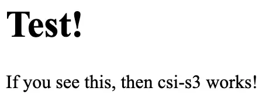

# Bottomless Kubernetes Storage with Tigris

There are three basic building blocks for every workload: compute, network, and
storage. Compute is cheap, network is relatively cheap, but storage can be
expensive. Tigris offers object storage, but what do you do when workloads don’t
support the object storage workflow?

You can use [csi-s3](https://github.com/yandex-cloud/k8s-csi-s3) to bridge the
gap and expose Tigris buckets as if they were normal PersistentVolumes, it even
supports the ReadWriteMany access mode so multiple Pods on multiple Nodes can
modify the same bucket at the same time.

Today, we’re going to cover how to install csi-s3 and get access to bottomless
storage on your Kubernetes clusters.

## Installing csi-s3

If you don’t already have helm installed, install it from your favorite package
manager:

```text
brew install helm
```

Create an admin token in the [Tigris Dash](https://console.tigris.dev). Its
credentials will be used in the next step.

With that admin token, install the csi-s3 operator:

```text
helm repo add yandex-s3 https://yandex-cloud.github.io/k8s-csi-s3/charts

helm install csi-s3 yandex-s3/csi-s3 \
  --set secret.accessKey=tid_... \
  --set secret.secretKey=tsec_... \
  --set secret.endpoint=https://t3.storage.dev \
  --set secret.region=auto \
  --set storageClass.name=tigris \
  --namespace=kube-system
```

That’s it! Now whenever you create a PersistentVolumeClaim with the StorageClass
`tigris`, your data will automatically be stored in a Tigris bucket.

## Usage

csi-s3 allows two ways to use buckets as PersistentVolumeClaims: with a randomly
generated bucket name, and to mount an existing bucket into your workloads.

### Using a randomly named bucket

In order to use a randomly named bucket, you need to create a
PersistentVolumeClaim with the StorageClass “tigris”. Here’s an example
PersistentVolumeClaim:

```yaml
apiVersion: v1
kind: PersistentVolumeClaim
metadata:
  name: infinite-storage
  namespace: default
spec:
  accessModes:
    - ReadWriteMany
    - ReadWriteOnce
  resources:
    requests:
      storage: 5Gi
  storageClassName: tigris
```

To use it, attach the PersistentVolumeClaim to the `volumes` and `volumeMounts`
of a Pod (or a Deployment):

```yaml
apiVersion: v1
kind: Pod
metadata:
  name: tigris-test-nginx
  namespace: default
spec:
  containers:
    - name: www
      image: nginx
      volumeMounts:
        - mountPath: /usr/share/nginx/html
          name: webroot
  volumes:
    - name: webroot
      persistentVolumeClaim:
        claimName: infinite-storage
        readOnly: false
```

Upload this file as `index.html`:

```html
<title>Test!</title>
<h1>Test!</h1>
<p>If you see this, then csi-s3 works!</p>
```

Then port-forward that pod:

```
kubectl port-forward pod/tigris-test-nginx 8080:80
```

And open your browser to http://localhost:8080. You should see the test message
smiling back at you:



And that’s it! You can now store data in Tigris as if it was on the disk. The
bucket will be named after the PersistentVolume created by Kubernetes, usually
looking something like `pvc-836006cd-f687-4819-92b9-6ff0fb908d61`.

### Using a bucket that already exists

Using a bucket that already exists is easy but slightly more involved. You need
to create a PersistentVolume pointing to the bucket and then a
PersistentVolumeClaim that points to that PersistentVolume. For example, here is
the PersistentVolume and PersistentVolumeClaim pair for the bucket named
`mybucket` :

```yaml
apiVersion: v1
kind: PersistentVolume
metadata:
  name: mybucket
spec:
  storageClassName: tigris
  capacity:
    storage: 10Ti
  accessModes:
    - ReadWriteMany
  claimRef:
    namespace: default
    name: mybucket
  csi:
    driver: ru.yandex.s3.csi
    controllerPublishSecretRef:
      name: csi-s3-secret
      namespace: csi-s3
    nodePublishSecretRef:
      name: csi-s3-secret
      namespace: csi-s3
    nodeStageSecretRef:
      name: csi-s3-secret
      namespace: csi-s3
    volumeAttributes:
      capacity: 10Ti
      mounter: geesefs
      options: --memory-limit 1000 --dir-mode 0777 --file-mode 0666
    volumeHandle: mybucket
---
apiVersion: v1
kind: PersistentVolumeClaim
metadata:
  name: mybucket
spec:
  storageClassName: "tigris"
  resources:
    requests:
      storage: 10Ti
  volumeMode: Filesystem
  accessModes:
    - ReadWriteMany
  volumeName: mybucket
```

Note that these both have to be created at the same time, otherwise the
bidirectional link between the PersistentVolume and the PersistentVolumeClaim
will not be established.

You can then mount it into a Pod (or Deployment) like normal:

```yaml
apiVersion: v1
kind: Pod
metadata:
  name: tigris-test-nginx
  namespace: default
spec:
  containers:
    - name: www
      image: nginx
      volumeMounts:
        - mountPath: /usr/share/nginx/html
          name: webroot
  volumes:
    - name: webroot
      persistentVolumeClaim:
        claimName: my-bucket
        readOnly: false
```

Upload this file as `index.html`:

```html
<title>Test!</title>
<h1>Test!</h1>
<p>If you see this, then csi-s3 works!</p>
```

Then port-forward that pod:

```
kubectl port-forward pod/tigris-test-nginx 8080:80
```

And open your browser to http://localhost:8080. You should see the test message
smiling back at you:


And that’s it! You can now store data in Tigris as if it was on the disk.
